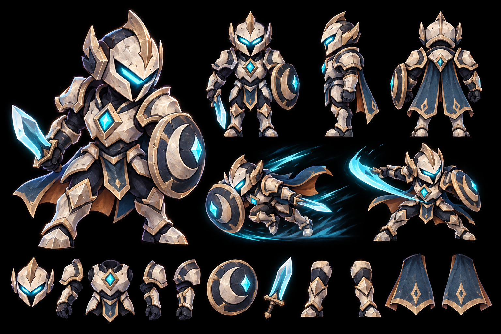
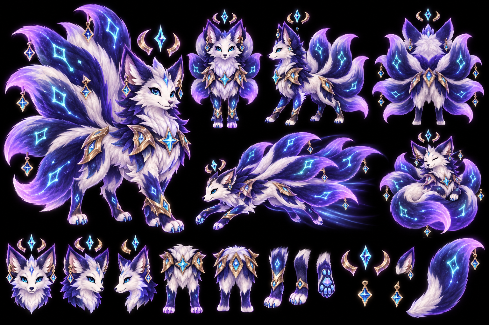

# Legendary / Mythic playable-character candidates v1

> **Status:** owner approval candidates only — not runtime art, not in the catalog, and not an
> implementation order yet.

These sheets explore one Legendary and one Mythic playable character after Veyra, Rook and Morrow.
Unlike Veyra, neither candidate is a Wisp or bodiless spirit. Both still remain cosmetic
presentations on the existing `WispPlayer` controller: identical collision, health, speed, dash,
damage, scoring and camera behaviour.

## Candidate A — Bram, the Rift Knight (Legendary)

- **Read:** a compact, brave armored knight with a complete body, shield and short soul-blade.
- **Tier rule:** large clean plates and restrained detail; premium through polish, not rig density.
- **Proposed rig groups (about 13):** helmet/head, torso/core, two upper arms, two forearms/hands,
  shield, soul-blade, two legs and two short cape panels.
- **Motion identity:** weighted idle stance; small shield breathing and cape follow-through; clear
  sword anticipation; shield-first dash tuck; short landing compression. No constant orbiters.
- **Effects ceiling:** one narrow cyan sword arc, shield sparks on impact and no more than 16 live
  particles.

## Candidate B — Nymera, the Ninefold (Mythic)

- **Read:** a fully formed celestial fox creature with head, body, four legs/paws and nine physical
  fur tails; never a flame-body or floating-mask character.
- **Tier rule:** collectible value comes from rich coordinated secondary motion while the face and
  torso remain readable at gameplay scale.
- **Proposed rig groups (about 34):** head/muzzle, two ears, neck/torso, four two-part legs, four
  armor plates, three crown pieces, six constellation charms and exactly nine multi-joint tails.
- **Motion identity:** ears listen independently; paws cycle through a weightless run; shoulder mane
  ripples; armor settles with delay; crown and charms orbit gently; nine tails weave, fan, curl and
  trail on independent spring chains without covering the face.
- **Effects ceiling:** a restrained constellation wake and no more than 28 live particles; the
  articulated character, not particle volume, carries the Mythic value.

## Approval gate

Approval may cover the name, silhouette, palette and tier treatment independently. After approval,
the next task is to prepare an implementation handoff for Claude: isolated RGBA layer source,
layer map and pivots, animation beat sheet for the existing 13-state vocabulary, particle budget,
catalog data, save-ID additions, mobile QA and acceptance tests.

Do not extract runtime layers or add either character to the catalog before that approval.

