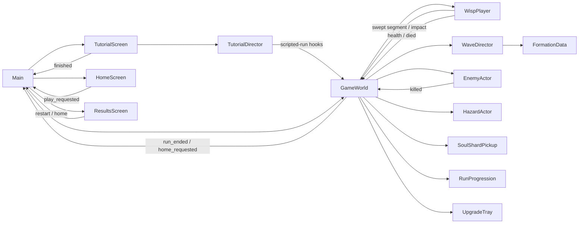

# Wisp Rush — Project Context

> **The canonical map of this project for humans and AI agents.** Read it before changing
> anything, and keep it true: if your change makes a line here wrong, fixing that line is part of
> the change. This file holds **meaning and intent**; the exhaustive, auto-generated inventory of
> what exists is [generated/PROJECT_MAP.md](generated/PROJECT_MAP.md).

_Last updated: 2026-09-18 · by: Claude Code (Opus 5)_

## 1. Identity

| Field | Value |
|---|---|
| Game | **Wisp Rush** — swipe-to-dash portrait survival action game (see [GDD.md](GDD.md)) |
| Engine | Godot **4.7.2-stable**, standard build, **GDScript only** |
| Editor binary | `/Users/dimitarslezenkovski/Desktop/Godot.app/Contents/MacOS/Godot` |
| Project root | repository root — `res://` = repo root, `project.godot` lives here |
| Renderer | Forward+ (default; revisit once art direction and platforms are known) |
| Genre · platforms · resolution | Survival arcade roguelite · Android/iOS + desktop debug · 1080×1920 design coordinates, expanding full-bleed viewport |
| Main scene | `res://scenes/main/main.tscn` (Home/gameplay scene host) |

## 2. Current status

- **Phase:** M10 (story Rifts, Endless, Rift Points Shop), M11 (RUSH) and M12 (Tutorial) built 2026-09-15,
  implementation only; runs on the owner's Android phone from a debug APK.
- **Works:** Loading → Tutorial (first launch) → animated Home → Rift story or Endless runs (five Rifts, twists, bosses;
  30 arena skins) → Results with a Rift Points breakdown; Rift Map, Trials, Daily, four-tab RP Shop (No Ads disabled);
  nine characters, three of them animated rigs (2026-09-17); save v8; synthesized audio; Reduced Motion; Android back.
  35 headless test scripts (`tools/run_tests.sh`), ten stale since M10.
- **Direction:** [ADR-0013](decisions/0013-rift-story-levels-endless-mode-and-rift-points.md) /
  [ADR-0014](decisions/0014-endless-arenas-share-one-floor-template.md), built from
  [specs/story_and_endless/](specs/story_and_endless/README.md) (specs 01–05 done).
- **Next:** owner review of the three characters (prices still 0), then the device pass (RP pacing, Endless
  difficulty, RUSH frequency, tutorial, characters) and the rest of M9 and M6 ([ROADMAP.md](ROADMAP.md)).

Keep this section ≤ 10 lines. Details belong in ROADMAP.md and DEVLOG.md.

## 3. Repository map

```
.
├── project.godot      Engine settings: autoloads, input map, layer names, main scene
├── icon.svg           Project icon
├── AGENTS.md          Operating manual for ANY AI agent — read first
├── CLAUDE.md          Claude Code entry point (imports AGENTS.md)
├── README.md          Human quick start
├── .mcp.json          MCP servers for Claude Code (Godot)
├── .claude/           Claude Code: settings.json, agents/ (subagents), skills/ (workflows)
├── concept_art/       Art source packs + generation prompts (read-only sources; not runtime) — ADR-0005, ADR-0014
├── addons/            Third-party Godot plugins — never edit by hand
├── assets/            Raw media: art/, audio/{music,sfx}/, fonts/, shaders/ — see docs/ASSETS.md
├── scenes/            One folder per feature: <thing>.tscn + <thing>.gd side by side
│   └── main/          Bootstrap entry scene
├── scripts/           Code not owned by a single scene
│   ├── autoload/      Global singletons (registered in project.godot + §5.3)
│   ├── components/    Reusable node components (health, hitbox, movement…)
│   ├── resources/     Custom Resource classes (data schemas, class_name'd)
│   └── utils/         Static helpers
├── data/              .tres instances of custom resources (tuning, levels, waves)
│   (assets/art/ is GENERATED by tools/art/; assets/ui/theme/ holds the project Theme;
│    assets/legacy_v1/ is the ignored archive of the previous art)
├── tests/             Reserved for a test framework (ROADMAP backlog); headless tests are tools/godot/test_*.gd
├── docs/              All documentation (.gdignore'd — invisible to Godot); docs/specs/ = agent work orders
└── tools/             Dev tooling (.gdignore'd)
    ├── validate.sh    Headless check (import, parse, boot, refresh map)
    ├── run_tests.sh   Runs every tools/godot/test_*.gd headless
    ├── qa_matrix.sh   Phone layout QA across five aspect ratios
    ├── project_map.mjs  Generates docs/generated/PROJECT_MAP.md
    ├── screenshot.sh  Renders N frames → logs/screenshot.png
    ├── godot/         GDScript tools run with --script (check_scripts, test_*, render_* fixtures)
    ├── art/           Python art pipeline: redesign and Endless extraction — ADR-0005, ADR-0014
    ├── video/         Devlog video helpers (Kokoro TTS, graphics, Palmier motion)
    └── mcp/           Pinned Godot MCP server (npm; node_modules git-ignored) — ADR-0002
```

Machine-local / generated, never edit: `.godot/` (engine cache), `logs/` (validator output),
`*.import` (edit via editor/MCP only). `*.uid` files are generated by Godot but **are committed**.
`video/` is the git-ignored devlog video workspace (footage, voiceover, exports) — [tools/video/README.md](../tools/video/README.md).

## 4. Architecture

`Main` is the composition root. It swaps self-contained Home, GameWorld and Results scenes in
response to upward signals and banks runs, rewards and Rift Points through the SaveManager autoload. GameWorld owns run statistics, combat routing, responsive
arena and HUD; the TutorialScreen hosts a scripted GameWorld driven by its TutorialDirector. WaveDirector requests deterministic, threat-budgeted FormationData; GameWorld
realizes them through EnemyActor and HazardActor prefabs. RunProgression owns XP and safe mutation
choices while GameWorld applies their effects. WispPlayer owns gesture/dash and health presentation,
then reports events upward. Balance lives in typed Resources under `data/`. Global services are the
three autoloads in §5.3, each backed by an ADR.



**Defaults** (apply unless an ADR overrides them; details in [CONVENTIONS.md](CONVENTIONS.md)):
- Composition over inheritance — behaviour as child component nodes.
- Call down, signal up. Cross-tree communication through an `EventBus` autoload (created when
  first needed; declares signals only).
- Tuning values in Resources under `data/`, never magic numbers in logic.
- Autoloads only for global services (EventBus, GameState, Audio, SceneLoader).

## 5. Registries

Hand-maintained tables that give **meaning** to what the project map lists. Keep them in sync with
`project.godot` and code in the same change (see §7.2).

### 5.1 Systems
| System | Status | Doc | Entry point |
|---|---|---|---|
| Game flow | ✅ done | [game_flow.md](systems/game_flow.md) | `res://scenes/main/main.tscn` |
| Player dash | ✅ done | [player_dash.md](systems/player_dash.md) | `res://scenes/player/wisp_player.tscn` |
| Player health | ✅ done | [player_health.md](systems/player_health.md) | `res://scripts/components/health_component.gd` |
| Core run | ✅ done | [core_run.md](systems/core_run.md) | `res://scenes/gameplay/game_world.tscn` |
| Enemies | ✅ done | [enemies.md](systems/enemies.md) | `res://scripts/components/enemy_actor.gd` |
| Tutorial | ✅ Tutorial screen, nine show-then-try lessons · device pass pending | [tutorial.md](systems/tutorial.md) | `res://scenes/tutorial/tutorial_screen.tscn` |
| Wave director | ✅ done | [wave_director.md](systems/wave_director.md) | `res://scenes/gameplay/wave_director.gd` |
| Arena hazards | ✅ done | [hazards.md](systems/hazards.md) | `res://scripts/components/hazard_actor.gd` |
| Run progression | ✅ done | [mutations.md](systems/mutations.md) | `res://scripts/components/run_progression.gd` |
| Reaper boss | ✅ done | [reaper_boss.md](systems/reaper_boss.md) | `res://scenes/bosses/reaper_boss.tscn` |
| Save manager | ✅ done | [save_manager.md](systems/save_manager.md) | `res://scripts/autoload/save_manager.gd` |
| Cosmetic forms | ✅ done · nine characters in the Shop's CHARACTERS tab | [forms.md](systems/forms.md) | `res://data/forms/default_catalog.tres` |
| Playable characters | ✅ Veyra, Rook, Morrow animated rigs (2026-09-17) · owner approval and device pass pending | [playable_character_visuals.md](systems/playable_character_visuals.md) | `res://scenes/player/visuals/playable_character_visual.gd` |
| Daily/challenges | ✅ done | [challenges.md](systems/challenges.md) | `res://scripts/utils/challenge_tracker.gd` |
| Audio | ✅ done | [audio.md](systems/audio.md) | `res://scripts/autoload/audio_service.gd` |
| Game feel & lifecycle | ✅ done | [game_feel.md](systems/game_feel.md) | `res://scenes/gameplay/game_world.gd` |
| RUSH mode and fast feel | ✅ done · device pass pending | [rush_mode.md](systems/rush_mode.md) | `res://data/feel/default_run_feel_tuning.tres` |
| Settings & statistics | ✅ done | [settings.md](systems/settings.md) | `res://scenes/screens/settings_screen.tscn` |
| UI design system | ✅ done | [ui_design_system.md](systems/ui_design_system.md) | `res://assets/ui/theme/wisp_theme.tres` |
| Rifts | ✅ done · one level per run (spec 02, ADR-0013) · device pass pending | [rifts.md](systems/rifts.md) | `res://scenes/screens/rift_map_screen.tscn` |
| Endless mode | ✅ 30 arena skins, animated Legendary/Mythic scenery (specs 03, 05) · device pass pending | [endless_mode.md](systems/endless_mode.md) | `res://data/endless/default_endless_catalog.tres` |
| Shop & Rift Points | ✅ Rift Points (spec 01), four-tab Shop and dash styles (spec 04) | [shop.md](systems/shop.md) | `res://scenes/screens/shop_screen.tscn` |
| Trials and depth milestones | ✅ done | [meta_progression.md](systems/meta_progression.md) | `res://scenes/screens/trials_screen.tscn` |
| Monetisation | 🔄 plumbing only | [monetisation.md](systems/monetisation.md) | `res://scripts/autoload/monetisation_service.gd` |

### 5.2 Key scenes
Only entry points, levels and major reusable prefabs — the map lists every scene.

| Scene | Purpose | System |
|---|---|---|
| `res://scenes/main/main.tscn` | Composition root: Loading, Tutorial, Home, Shop, Rift Map, Daily, Trials, Statistics, Settings, GameWorld or Results; back routing | Game flow |
| `res://scenes/screens/home_screen.tscn` | Home: top bar (Rift Points, best), tappable live hero character (→ Shop CHARACTERS) over a living background between Trials/Daily and Shop/Remove Ads columns, ENDLESS (once open) + animated PLAY + Rifts under it | Game flow |
| `res://scenes/screens/shop_screen.tscn` | The only place RP is spent: tabs CHARACTERS (animated cards), DASHES, ARENAS (card carousels, buy/equip) and NO ADS (Remove Ads + Restore, disabled until billing exists, no RP; ADR-0012, ADR-0013) | Shop / Monetisation |
| `res://scenes/gameplay/game_world.tscn` | Responsive playable arena and run-local coordinator | Core run |
| `res://scenes/player/wisp_player.tscn` | Aiming, dash, health and death player prefab; hosts the equipped character's rig | Player dash / health |
| `res://scenes/player/visuals/{veyra,rook,morrow}_visual.tscn` | The three animated character rigs on the shared `PlayableCharacterVisual` base (ADR-0015) | Playable characters |
| `res://scenes/enemies/soul_wisp.tscn` | One-hit steering enemy prefab | Enemies |
| `res://scenes/enemies/shard_wraith.tscn` | Two-hit angular dart enemy prefab | Enemies |
| `res://scenes/enemies/bone_mote.tscn` | Three-hit predictive charge enemy prefab | Enemies |
| `res://scenes/hazards/split_void_crystal.tscn` | Indestructible dash-blocking obstacle prefab | Arena hazards |
| `res://scenes/hazards/spike_bloom.tscn` | Cycled area-danger prefab | Arena hazards |
| `res://scenes/hazards/blade_ring.tscn` | Rotating blade-tip danger prefab | Arena hazards |
| `res://scenes/pickups/soul_shard_pickup.tscn` | Rift Points shard drop and attraction prefab (keeps the shard file name) | Run progression |
| `res://scenes/gameplay/upgrade_tray.tscn` | Bottom three-card upgrade tray shown at calm moments over the slowed, live run (no pause) | Run progression |
| `res://scenes/tutorial/tutorial_screen.tscn` | Tutorial screen: scripted placeholder arena, ghost-hand lessons, step counter, SKIP confirm (first launch; replay from the Rift Map) | Tutorial |
| `res://scenes/screens/results_screen.tscn` | Score, run statistics, Rift Points breakdown (collected, performance, rewards, total, balance) and navigation | Game flow |
| `res://scenes/bosses/reaper_boss.tscn` | Recurring three-phase Reaper encounter prefab | Reaper boss |
| `res://scenes/screens/daily_screen.tscn` | Daily run (Endless rules) arena of the day, seed, best, reward and three challenges | Daily/challenges |
| `res://scenes/screens/loading_screen.tscn` | Boot: streams screens and waits for audio synthesis (≤ 6 s) | Game flow |
| `res://scenes/screens/settings_screen.tscn` | Settings, Privacy & About, armed reset; also the in-run overlay | Settings & statistics |
| `res://scenes/screens/statistics_screen.tscn` | Lifetime statistics | Settings & statistics |
| `res://scenes/screens/rift_map_screen.tscn` | Arena ladder card carousel: rule twist, unlock gate, level progress and per-Rift best; TUTORIAL replay | Rifts |
### 5.3 Autoloads
| Name | Script | Responsibility |
|---|---|---|
| `SaveManager` | `res://scripts/autoload/save_manager.gd` (`SaveManagerService`) | Versioned local progression: validation, migration, atomic save + backup; automated runs use `user://test_runs/` ([ADR-0003](decisions/0003-save-manager-autoload.md)) |
| `Audio` | `res://scripts/autoload/audio_service.gd` (`AudioService`) | Runtime-synthesized SFX and layered music on Master/Music/SFX/UI buses; call through `SoundFx` ([ADR-0004](decisions/0004-runtime-synthesized-audio.md)) |
| `Monetisation` | `res://scripts/autoload/monetisation_service.gd` (`MonetisationService`) | Opt-in rewarded placements and the Remove Ads product behind an injected `AdProvider`; ships with `NullAdProvider`, so nothing is offered ([ADR-0009](decisions/0009-monetisation-model.md)) |

### 5.4 Input actions
| Action | Default bindings | Meaning |
|---|---|---|
| `move_left` | A, Left | Aim left (desktop QA) |
| `move_right` | D, Right | Aim right (desktop QA) |
| `move_up` | W, Up | Aim up (desktop QA) |
| `move_down` | S, Down | Aim down (desktop QA) |
| `dash` | Space | Launch along the keyboard aim vector |
| `pause` | Escape | Open or close the topmost pause overlay |

### 5.5 Physics layers
| Layer | Name | Used by |
|---|---|---|
| _none yet_ | | |

### 5.6 Groups
| Group | Members | Used for |
|---|---|---|
| `enemies` | All three regular enemy prefabs | Focus, contact and combat queries |
| `hazards` | Crystal, bloom and blade-ring prefabs | Focus, dash blocking and danger queries |
| `pickups` | Soul Shard pickup prefab | Dash collection and attraction queries |
| `bosses` | Reaper boss prefab | Boss-only queries during the recurring encounter |

### 5.7 Global signals (EventBus)
| Signal | Args | Emitted by | Listened by |
|---|---|---|---|
| _none yet_ | | | |

### 5.8 Data resource types
| Class | Script | Instances in | Purpose |
|---|---|---|---|
| `PlayerTuning` | `res://scripts/resources/player_tuning.gd` | `res://data/player/default_player_tuning.tres` | Dash, input, health and impact starting values |
| `EnemyTuning` | `res://scripts/resources/enemy_tuning.gd` | `res://data/enemies/*.tres` | Enemy health, actions, threat and rewards |
| `FormationData` | `res://scripts/resources/formation_data.gd` | `res://data/formations/*.tres` | Normalized authored enemy/hazard encounter |
| `FormationCatalog` | `res://scripts/resources/formation_catalog.gd` | `res://data/waves/default_catalog.tres` | Ordered complete formation registry |
| `WaveTuning` | `res://scripts/resources/wave_tuning.gd` | `res://data/waves/default_wave_tuning.tres` | Wave duration, budget and spawn cadence |
| `HazardTuning` | `res://scripts/resources/hazard_tuning.gd` | `res://data/hazards/*.tres` | Hazard scale, collision and cycle timing |
| `MutationData` | `res://scripts/resources/mutation_data.gd` | `res://data/mutations/*.tres` | Mutation identity, cap, value, copy and icon |
| `RunProgressionTuning` | `res://scripts/resources/run_progression_tuning.gd` | `res://data/progression/default_run_progression.tres` | XP curve, shared mutation-effect tuning and the upgrade offer (tray slow motion, timeout, slide, calm window, indicator pulse) |
| `ReaperTuning` | `res://scripts/resources/reaper_tuning.gd` | `res://data/bosses/default_reaper.tres`, `res://data/bosses/*_tuning.tres` | Reaper health, phase timings, attack geometry and rewards (one per boss variant) |
| `BossData` | `res://scripts/resources/boss_data.gd` | `res://data/bosses/{reaper,reaper_ascended,hollow_choir,the_fracture,cinder_maw}.tres` | One boss variant on the shared `ReaperBoss` machine: atlas, toughness, accent; referenced by `RiftData.boss_id` ([ADR-0010](decisions/0010-data-driven-boss-variants.md)) |
| `FormData` | `res://scripts/resources/form_data.gd` | `res://data/forms/*.tres` (9) | Character identity, price, requirement, portrait, tint and optional `visual_scene` rig |
| `FormCatalog` | `res://scripts/resources/form_catalog.gd` | `res://data/forms/default_catalog.tres` | Ordered nine-character registry (`REQUIRED_FORM_COUNT`) and validation |
| `DashStyleData` | `res://scripts/resources/dash_style_data.gd` | `res://data/dash_styles/*.tres` | Dash style: id, name, price, `trail_tint`, `burst_tint`, `uses_form_tint`; reserved-hue check |
| `DashStyleCatalog` | `res://scripts/resources/dash_style_catalog.gd` | `res://data/dash_styles/default_dash_style_catalog.tres` | Ordered dash styles (SOUL free default), lookup, save ids, validation |
| `RiftData` | `res://scripts/resources/rift_data.gd` | `res://data/rifts/*.tres` | Arena identity, backdrop, unlock gate and rule twist |
| `RiftCatalog` | `res://scripts/resources/rift_catalog.gd` | `res://data/rifts/default_catalog.tres` | Ordered five-Rift ladder and validation |
| `ArenaSkinData` | `res://scripts/resources/arena_skin_data.gd` | `res://data/endless/skins/*.tres` (30, generated) | One Endless background skin: id, name, tier, price, accent, lazy `background_path`, `thumbnail`, `scenery` (Legendary/Mythic), `placeholder`; no floor polygon (ADR-0014) |
| `ArenaSceneryData` / `ArenaSceneryZone` / `ArenaParticleEmitter` | `res://scripts/resources/arena_scenery_data.gd` / `arena_scenery_zone.gd` / `arena_particle_emitter.gd` | sub-resources of the 10 Legendary/Mythic `data/endless/skins/*.tres` (generated from `tools/art/endless_scenery.py`) | Animated scenery: mask, grade, set piece, sweep, shooting stars · light + distortion of one mask zone · one glow-particle stream with floor-clear emission points; run by `ArenaAmbience` + `arena_scenery.gdshader` |
| `EndlessTuning` | `res://scripts/resources/endless_tuning.gd` | `res://data/endless/default_endless_tuning.tres` | Endless boss cadence, per-cycle threat and enemy speed, fixed daily pool |
| `EndlessCatalog` | `res://scripts/resources/endless_catalog.gd` | `res://data/endless/default_endless_catalog.tres` | Floor template polygon, skins, default skin, tuning; arena of the day; validation |
| `EconomyTuning` | `res://scripts/resources/economy_tuning.gd` | `res://data/economy/default_economy_tuning.tres` | Rift Points payouts that are not pickups: `score_per_rift_point` performance bonus and the level-clear bonuses; `placeholder` until calibrated on a device |
| `RunFeelTuning` | `res://scripts/resources/run_feel_tuning.gd` | `res://data/feel/default_run_feel_tuning.tres` | Visible momentum, shard sweep, slow-motion finisher and RUSH meter/mode values (GDD §5.6, §14 #27) |
| `TutorialLessonData` / `TutorialCatalog` | `res://scripts/resources/tutorial_lesson_data.gd` / `tutorial_catalog.gd` | `res://data/tutorial/default_tutorial.tres` | Tutorial lessons (captions, goal, placements, demo swipes, XP/RUSH switches, upgrade tap demo), placeholder arena skin id, boss health and timings |
| `TrialData` / `TrialCatalog` | `res://scripts/resources/trial_data.gd` / `trial_catalog.gd` | `res://data/trials/*.tres` | Trials ladder goals, Rift Points rewards and the 12-tier catalog |

## 6. Tooling

| Task | How |
|---|---|
| Full headless check (import → parse all scripts → boot main scene → refresh map) | `tools/validate.sh` |
| Refresh the project map | `node tools/project_map.mjs` |
| Is the map current? | `node tools/project_map.mjs --check` |
| Run all headless tests (per-test timeout, logs in `logs/tests/`) | `tools/run_tests.sh [name-filter]` |
| Visual QA fixtures (render with `--write-movie`; usage in each file header) | `tools/godot/render_*_showcase.gd` |
| Performance overlay in a running debug build | press F3 |
| Phone layout QA: screens × 5 phone aspect ratios → `logs/qa/<screen>_sheet.png` | `tools/qa_matrix.sh [screens…]` |
| Frame-time benchmark (crowded run) | `Godot --headless --path . --script res://tools/godot/bench_stress.gd` |
| Regenerate runtime art from the redesign sheets | `python3 tools/art/extract_redesign.py`, then `tools/validate.sh` |
| Regenerate the playable-character layers (and print their ribbon spines) | `python3 tools/art/extract_playable_characters.py [veyra rook morrow]`, then `tools/validate.sh` |
| Character visual QA: reference vs rig, motion frames, Shop/Home/gameplay shots | `tools/godot/render_character_{lineup,motion,select_showcase,home_showcase,gameplay_showcase}.*` + `python3 tools/art/motion_contact_sheet.py <id>` ([playable_character_visuals.md](systems/playable_character_visuals.md)) |
| What live character previews cost to build and run | `Godot --headless --path . --script res://tools/godot/bench_character_previews.gd` |
| Rebuild the UI Theme | steps in [ui_design_system.md](systems/ui_design_system.md) |
| Build + deploy the Android debug APK (device over USB) | `JAVA_HOME=$(/usr/libexec/java_home) "$GODOT" --headless --path . --export-debug "Android" build/android/wisp_rush_debug.apk` then `~/Library/Android/sdk/platform-tools/adb install -r -t build/android/wisp_rush_debug.apk` and `adb shell monkey -p com.cognitix.wisprush -c android.intent.category.LAUNCHER 1` (the activity is `GodotAppLauncher` and is **not exported**, so `am start -n` is denied) |
| Render at an explicit window aspect | `tools/screenshot.sh [scene] [frames] [size]` (PNG remains at design resolution; runtime log reports the expanded arena) |
| TikTok / Shorts devlog videos: bot-played capture, Kokoro voices + captions, game sounds, graphic pieces, edit in Palmier Pro (MCP) | recipe [marketing/devlog_video_recipe.md](marketing/devlog_video_recipe.md); hooks [marketing/devlog_hooks.md](marketing/devlog_hooks.md); commands [tools/video/README.md](../tools/video/README.md) (`tools/godot/{render_gameplay_clip,render_devlog_tour,render_arena_showcase,render_feel_showcase,export_game_audio}.gd`, `tools/video/{kokoro_tts,devlog_graphics,palmier_motion}.py`) |
| Run the game / open the editor / drive Godot from an agent | See [AGENTS.md](../AGENTS.md) §4 (commands + Godot MCP) |

## 7. Documentation rules

These rules exist so any agent, in any session, can answer "what is this, where is it, why is it
like this" in minutes. **A change is not done until its documentation is.**

### 7.1 One fact, one home
| Question | Authoritative file |
|---|---|
| How do agents work in this repo? | `AGENTS.md` (+ `CLAUDE.md` for Claude Code specifics) |
| What is the game? | `docs/GDD.md` |
| Where is X, what is registered, what are the rules? | `docs/PROJECT_CONTEXT.md` (this file) |
| What exists, exhaustively? | `docs/generated/PROJECT_MAP.md` — generated, never hand-edit |
| How does system X work? | `docs/systems/<system>.md` |
| Why was Y decided? | `docs/decisions/NNNN-*.md` (ADRs) |
| How must code look? | `docs/CONVENTIONS.md` |
| What's planned / in progress? | `docs/ROADMAP.md` |
| What exactly should an agent build next, and in what order? | `docs/specs/<feature>/` — work orders with acceptance checks; they link to the GDD/ADRs, which win on conflict, and system docs take over once a phase is built |
| What happened, when, by whom? | `docs/DEVLOG.md` |
| What can we show publicly, and how do we film it? | `docs/marketing/devlog_video_brief.md` |
| How is a devlog video made (rules, structure, Palmier blueprint, QA)? | `docs/marketing/devlog_video_recipe.md` |
| Which hook should a devlog video open with? | `docs/marketing/devlog_hooks.md` |
| What should the next devlog episodes cover, and how do I shoot them? | `docs/marketing/devlog_characters_episodes.md` (the planned character episodes); the episode table in `tools/video/README.md` is the status of record |
| Where did an asset come from, how is it imported? | `docs/ASSETS.md` |
| What does this class / method do? | `##` doc comments in the `.gd` file |

Never copy a fact into a second file — link to its home. If two files disagree, the home in this
table wins; fix the other one.

### 7.2 Update triggers — if you do X, update Y in the same change
| Change | Update |
|---|---|
| New gameplay system | new `docs/systems/<name>.md` from `_TEMPLATE.md`; row in §5.1; ROADMAP item |
| Scene/script added, renamed, moved, removed | `##` class doc; system doc Files table; §5.2 if it is a key scene; re-run map |
| Public API of a system changed | system doc Public API; `##` docs |
| Autoload added/removed | §5.3; ADR if it adds a new global service |
| Input action added/changed | §5.4; GDD §4 controls table |
| Physics layer or group added | §5.5 / §5.6 |
| EventBus signal added/changed | §5.7; emitter and listener system docs |
| New Resource type or data file | §5.8; system doc Data & tuning |
| Asset added/replaced/removed | `docs/ASSETS.md` registry |
| Design rule changed | `docs/GDD.md` + its change-history row |
| Architecture choice, new addon/dependency, reversing an earlier decision | new ADR |
| Milestone or phase moved | §2 here + `docs/ROADMAP.md` |
| End of every work session | `docs/DEVLOG.md` entry |

### 7.3 Code documentation
- Every script starts with a `##` class doc; its **first line is a one-sentence summary** (the
  project map shows it and flags scripts without one).
- `##` on every public method, signal, exported variable and enum whose meaning isn't obvious from
  name + type. Include units (`seconds`, `px/s`) and valid ranges.
- Comments explain *why*, not *what*. TODO format: `# TODO(<scope>): <what>` — mirror non-trivial
  TODOs in the system doc's Known issues.
- Godot shows `##` docs in the editor help (F1) and can export them:
  `Godot --doctool docs/generated/api --gdscript-docs res://scripts`.

### 7.4 System docs
- One file per gameplay system, `docs/systems/<system_name>.md`, from `_TEMPLATE.md`.
- ≤ ~150 lines. Public API and data/tuning sections are mandatory; code snippets only for API.
- Status line and change history are updated whenever the system changes.

### 7.5 Decision records (ADRs)
- Write one for: architecture patterns, new autoloads/services, addons or external dependencies,
  renderer/platform choices, anything expensive to reverse, and any reversal of an earlier ADR.
- Numbered `NNNN-kebab-title.md`, from `_TEMPLATE.md`. Immutable once accepted — supersede with a
  new ADR and only edit the old one's status line.

### 7.6 DEVLOG entries
Newest first, one per work session:
```
## YYYY-MM-DD — <short title>
- **Who:** <agent/model or human>
- **Did:** what changed and why (1–5 bullets)
- **Files/systems:** main paths touched
- **Verified:** validate.sh result, what was run/observed (MCP run, screenshot, manual)
- **Follow-ups:** open issues, next steps, questions for the owner
```

### 7.7 Writing style
- Terse. Tables and bullets over prose. Present tense, English.
- Game files as `res://…` paths; other files repo-relative. Markdown links are relative.
- Dates ISO `YYYY-MM-DD`. Unknowns `_TBD_`. Guesses marked `ASSUMPTION:` (and listed in GDD §14
  when design-related).
- Don't document what the generated map already shows (file lists, signal names) — document
  meaning, relationships and rules.

### 7.8 Definition of Done (every change)
- [ ] `tools/validate.sh` prints `VALIDATE: OK` and `tools/run_tests.sh` reports 0 failed
- [ ] Behaviour verified by running the game (Godot MCP run + debug output / screenshot, or manually)
- [ ] `##` docs on new or changed public API; no new "missing class doc" gaps in the map
- [ ] Update triggers in §7.2 satisfied
- [ ] `docs/generated/PROJECT_MAP.md` regenerated (validate.sh does it) and committed
- [ ] DEVLOG entry written

## 8. Glossary

| Term | Meaning |
|---|---|
| Wisp | The player's small purple spirit; source art filenames retain the older `riftling` label |
| Character | What the player equips: one of six single-image Wisp forms or one of the three animated characters (Veyra, Rook, Morrow). Cosmetic only. Code and save keep the older "form" names (`FormData`, `owned_forms`, the Shop's `wisps` tab id) |
| Soul Fragment | One unit of player health; a normal run starts with three |
| Soul Shard | The old name of the currency, renamed Rift Points on 2026-09-15 (ADR-0013, spec 01). Only file and class names keep it: `soul_shard_pickup.*` / `SoulShardPickup` and the `02_soul_shards` icon are the Rift Points pickup and icon. Never player-facing; unrelated to the Shard Wraith enemy |
| Rift Points (RP) | The only currency: earned only by playing, spent only on cosmetics, never bought. Text: `1,250 RP` after numbers, "Rift Points" in sentences (`RiftPoints`) |
| Performance bonus | Rift Points a run pays from its score: `score / EconomyTuning.score_per_rift_point` (`rp_performance`) |
| Rift level | One of a Rift's 8 levels; after ADR-0013 a story run plays exactly one, and a cleared Rift N level 1 opens Rift N+1 |
| Endless | The never-ending mode (ADR-0013), on cosmetic arena skins over one shared floor |
| Arena skin | A purchasable Endless background; it never changes the playfield |
| Floor template | The one playable floor every Endless skin shares — `concept_art/wisp_rush_endless_v1/floor_template.json` (ADR-0014) |
| Wisp Focus | Brief enemy/hazard slowdown after a normal wall impact; input stays responsive |
