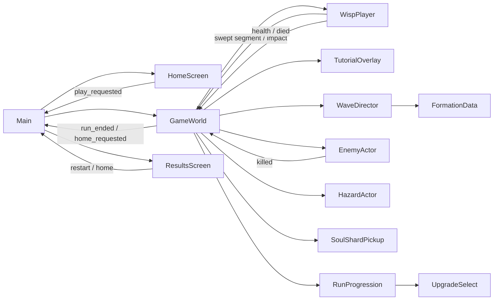

# Wisp Rush — Project Context

> **The canonical map of this project for humans and AI agents.** Read it before changing
> anything, and keep it true: if your change makes a line here wrong, fixing that line is part of
> the change. This file holds **meaning and intent**; the exhaustive, auto-generated inventory of
> what exists is [generated/PROJECT_MAP.md](generated/PROJECT_MAP.md).

_Last updated: 2026-09-13 · by: Claude Code (Opus 5)_

## 1. Identity

| Field | Value |
|---|---|
| Game | **Wisp Rush** — swipe-to-dash portrait survival action game (see [GDD.md](GDD.md)) |
| Engine | Godot **4.7.2-stable**, standard build, **GDScript only** |
| Editor binary | `/Users/dimitarslezenkovski/Desktop/Godot.app/Contents/MacOS/Godot` |
| Project root | repository root — `res://` = repo root, `project.godot` lives here |
| Renderer | Forward+ (default; revisit once art direction and platforms are known) |
| Genre · platforms · resolution | Survival arcade roguelite · Android/iOS + desktop debug · 1080×1920 design coordinates, expanding full-bleed viewport |
| Main scene | `res://scenes/main/main.tscn` (Home/gameplay scene host) |

## 2. Current status

- **Phase:** Redesign v1 integrated (ADR-0005) and the playfield/sprite composition settled
  (ADR-0006). Runs on the owner's Android phone from a debug APK. Next: direction/monetisation.
- **Works:** Loading → animated Home (Play + nav: Rifts, Forms, Sanctum, Trials, Daily; Stats,
  Settings) → tutorial or endless waves with the recurring Reaper → Results; persistent save;
  runtime-synthesized SFX and adaptive music; shake, hit-stop and haptics with Reduced Motion; pause
  menu with confirmations; auto-pause on interruption; Android back. 33 headless test scripts pass (`tools/run_tests.sh`).
- **Direction settled 2026-09-12:** one endless mode, engagement layered around it; M7 engagement
  core → M8 Rifts → M9 monetisation (rewarded video + one remove-ads IAP). See [ROADMAP.md](ROADMAP.md).
- **In flight:** Rifts ladder + map UI shipped ([ADR-0007](decisions/0007-rifts-as-rule-variant-arenas.md));
  no rule twist implemented yet, so all five arenas still play identically.

Keep this section ≤ 10 lines. Details belong in ROADMAP.md and DEVLOG.md.

## 3. Repository map

```
.
├── project.godot      Engine settings: autoloads, input map, layer names, main scene
├── icon.svg           Project icon
├── AGENTS.md          Operating manual for ANY AI agent — read first
├── CLAUDE.md          Claude Code entry point (imports AGENTS.md)
├── README.md          Human quick start
├── .mcp.json          MCP servers for Claude Code (Godot)
├── .claude/           Claude Code: settings.json, agents/ (subagents), skills/ (workflows)
├── concept_art/       Redesign source packs (read-only sources; not runtime) — ADR-0005
├── addons/            Third-party Godot plugins — never edit by hand
├── assets/            Raw media: art/, audio/{music,sfx}/, fonts/, shaders/ — see docs/ASSETS.md
├── scenes/            One folder per feature: <thing>.tscn + <thing>.gd side by side
│   └── main/          Bootstrap entry scene
├── scripts/           Code not owned by a single scene
│   ├── autoload/      Global singletons (registered in project.godot + §5.3)
│   ├── components/    Reusable node components (health, hitbox, movement…)
│   ├── resources/     Custom Resource classes (data schemas, class_name'd)
│   └── utils/         Static helpers
├── data/              .tres instances of custom resources (tuning, levels, waves)
│   (assets/art/ is GENERATED by tools/art/; assets/ui/theme/ holds the project Theme;
│    assets/legacy_v1/ is the ignored archive of the previous art)
├── tests/             Automated tests (framework TBD — see ROADMAP backlog)
├── docs/              All documentation (.gdignore'd — invisible to Godot)
└── tools/             Dev tooling (.gdignore'd)
    ├── validate.sh    Headless check (import, parse, boot, refresh map)
    ├── project_map.mjs  Generates docs/generated/PROJECT_MAP.md
    ├── screenshot.sh  Renders N frames → logs/screenshot.png
    ├── godot/         GDScript tools run with --script (check_scripts.gd)
    └── mcp/           Pinned Godot MCP server (npm; node_modules git-ignored) — ADR-0002
```

Machine-local / generated, never edit: `.godot/` (engine cache), `logs/` (validator output),
`*.import` (edit via editor/MCP only). `*.uid` files are generated by Godot but **are committed**.

## 4. Architecture

`Main` is the composition root. It swaps self-contained Home, GameWorld and Results scenes in
response to upward signals and remembers tutorial completion, best score and earned Soul Shards
for the current app session. GameWorld owns run statistics, combat routing, tutorial, responsive
arena and HUD. WaveDirector requests deterministic, threat-budgeted FormationData; GameWorld
realizes them through EnemyActor and HazardActor prefabs. RunProgression owns XP and safe mutation
choices while GameWorld applies their effects. WispPlayer owns gesture/dash and health presentation,
then reports events upward. Balance lives in typed Resources under `data/`. No autoload is needed
yet; persistent save/audio services require their own ADR when introduced.



**Defaults** (apply unless an ADR overrides them; details in [CONVENTIONS.md](CONVENTIONS.md)):
- Composition over inheritance — behaviour as child component nodes.
- Call down, signal up. Cross-tree communication through an `EventBus` autoload (created when
  first needed; declares signals only).
- Tuning values in Resources under `data/`, never magic numbers in logic.
- Autoloads only for global services (EventBus, GameState, Audio, SceneLoader).

## 5. Registries

Hand-maintained tables that give **meaning** to what the project map lists. Keep them in sync with
`project.godot` and code in the same change (see §7.2).

### 5.1 Systems
| System | Status | Doc | Entry point |
|---|---|---|---|
| Game flow | ✅ done | [game_flow.md](systems/game_flow.md) | `res://scenes/main/main.tscn` |
| Player dash | ✅ done | [player_dash.md](systems/player_dash.md) | `res://scenes/player/wisp_player.tscn` |
| Player health | ✅ done | [player_health.md](systems/player_health.md) | `res://scripts/components/health_component.gd` |
| Core run | ✅ done | [core_run.md](systems/core_run.md) | `res://scenes/gameplay/game_world.tscn` |
| Enemies | ✅ done | [enemies.md](systems/enemies.md) | `res://scripts/components/enemy_actor.gd` |
| Tutorial | ✅ done | [tutorial.md](systems/tutorial.md) | `res://scenes/tutorial/tutorial_overlay.tscn` |
| Wave director | ✅ done | [wave_director.md](systems/wave_director.md) | `res://scenes/gameplay/wave_director.gd` |
| Arena hazards | ✅ done | [hazards.md](systems/hazards.md) | `res://scripts/components/hazard_actor.gd` |
| Run progression | ✅ done | [mutations.md](systems/mutations.md) | `res://scripts/components/run_progression.gd` |
| Reaper boss | ✅ done | [reaper_boss.md](systems/reaper_boss.md) | `res://scenes/bosses/reaper_boss.tscn` |
| Save manager | ✅ done | [save_manager.md](systems/save_manager.md) | `res://scripts/autoload/save_manager.gd` |
| Cosmetic forms | ✅ done | [forms.md](systems/forms.md) | `res://scenes/screens/forms_screen.tscn` |
| Daily/challenges | ✅ done | [challenges.md](systems/challenges.md) | `res://scripts/utils/challenge_tracker.gd` |
| Audio | ✅ done | [audio.md](systems/audio.md) | `res://scripts/autoload/audio_service.gd` |
| Game feel & lifecycle | ✅ done | [game_feel.md](systems/game_feel.md) | `res://scenes/gameplay/game_world.gd` |
| Settings & statistics | ✅ done | [settings.md](systems/settings.md) | `res://scenes/screens/settings_screen.tscn` |
| UI design system | ✅ done | [ui_design_system.md](systems/ui_design_system.md) | `res://assets/ui/theme/wisp_theme.tres` |
| Rifts | 🔄 in progress | [rifts.md](systems/rifts.md) | `res://scenes/screens/rift_map_screen.tscn` |
| Soul Sanctum | ✅ done | [meta_progression.md](systems/meta_progression.md) | `res://scenes/screens/sanctum_screen.tscn` |
| Trials ladder | ✅ done | [meta_progression.md](systems/meta_progression.md) | `res://scenes/screens/trials_screen.tscn` |
| Monetisation | 🔄 plumbing only | [monetisation.md](systems/monetisation.md) | `res://scripts/autoload/monetisation_service.gd` |

### 5.2 Key scenes
Only entry points, levels and major reusable prefabs — the map lists every scene.

| Scene | Purpose | System |
|---|---|---|
| `res://scenes/main/main.tscn` | Composition root: Loading, Home, Forms, Daily, Statistics, Settings, GameWorld or Results; back routing | Game flow |
| `res://scenes/screens/home_screen.tscn` | Home: top bar, animated hero Wisp over a living background (`HomeAmbience`, `OrbitMotes`), PLAY, bottom nav | Game flow |
| `res://scenes/gameplay/game_world.tscn` | Responsive playable arena and run-local coordinator | Core run |
| `res://scenes/player/wisp_player.tscn` | Aiming, dash, health and death player prefab | Player dash / health |
| `res://scenes/enemies/soul_wisp.tscn` | One-hit steering enemy prefab | Enemies |
| `res://scenes/enemies/shard_wraith.tscn` | Two-hit angular dart enemy prefab | Enemies |
| `res://scenes/enemies/bone_mote.tscn` | Three-hit predictive charge enemy prefab | Enemies |
| `res://scenes/hazards/split_void_crystal.tscn` | Indestructible dash-blocking obstacle prefab | Arena hazards |
| `res://scenes/hazards/spike_bloom.tscn` | Cycled area-danger prefab | Arena hazards |
| `res://scenes/hazards/blade_ring.tscn` | Rotating blade-tip danger prefab | Arena hazards |
| `res://scenes/pickups/soul_shard_pickup.tscn` | Run-currency drop and attraction prefab | Run progression |
| `res://scenes/screens/upgrade_select.tscn` | Safe paused three-mutation choice overlay | Run progression |
| `res://scenes/tutorial/tutorial_overlay.tscn` | Non-blocking first-run guidance overlay | Tutorial |
| `res://scenes/screens/results_screen.tscn` | Score, run statistics, shard summary and navigation | Game flow |
| `res://scenes/bosses/reaper_boss.tscn` | Recurring three-phase Reaper encounter prefab | Reaper boss |
| `res://scenes/screens/forms_screen.tscn` | Card carousel to preview, claim and equip the six cosmetic forms | Cosmetic forms |
| `res://scenes/screens/daily_screen.tscn` | Rift of the Day seed, best, reward and three challenges | Daily/challenges |
| `res://scenes/screens/loading_screen.tscn` | Boot: streams screens and waits for audio synthesis (≤ 6 s) | Game flow |
| `res://scenes/screens/settings_screen.tscn` | Settings, Privacy & About, armed reset; also the in-run overlay | Settings & statistics |
| `res://scenes/screens/statistics_screen.tscn` | Lifetime statistics | Settings & statistics |
| `res://scenes/screens/rift_map_screen.tscn` | Arena ladder card carousel: rule twist, unlock gate, level progress and per-Rift best | Rifts |
### 5.3 Autoloads
| Name | Script | Responsibility |
|---|---|---|
| `SaveManager` | `res://scripts/autoload/save_manager.gd` (`SaveManagerService`) | Versioned local progression: validation, migration, atomic save + backup; automated runs use `user://test_runs/` ([ADR-0003](decisions/0003-save-manager-autoload.md)) |
| `Audio` | `res://scripts/autoload/audio_service.gd` (`AudioService`) | Runtime-synthesized SFX and layered music on Master/Music/SFX/UI buses; call through `SoundFx` ([ADR-0004](decisions/0004-runtime-synthesized-audio.md)) |
| `Monetisation` | `res://scripts/autoload/monetisation_service.gd` (`MonetisationService`) | Opt-in rewarded placements and the Remove Ads product behind an injected `AdProvider`; ships with `NullAdProvider`, so nothing is offered ([ADR-0009](decisions/0009-monetisation-model.md)) |

### 5.4 Input actions
| Action | Default bindings | Meaning |
|---|---|---|
| `move_left` | A, Left | Aim left (desktop QA) |
| `move_right` | D, Right | Aim right (desktop QA) |
| `move_up` | W, Up | Aim up (desktop QA) |
| `move_down` | S, Down | Aim down (desktop QA) |
| `dash` | Space | Launch along the keyboard aim vector |
| `pause` | Escape | Open or close the topmost pause overlay |

### 5.5 Physics layers
| Layer | Name | Used by |
|---|---|---|
| _none yet_ | | |

### 5.6 Groups
| Group | Members | Used for |
|---|---|---|
| `enemies` | All three regular enemy prefabs | Focus, contact and combat queries |
| `hazards` | Crystal, bloom and blade-ring prefabs | Focus, dash blocking and danger queries |
| `pickups` | Soul Shard pickup prefab | Dash collection and attraction queries |
| `bosses` | Reaper boss prefab | Boss-only queries during the recurring encounter |

### 5.7 Global signals (EventBus)
| Signal | Args | Emitted by | Listened by |
|---|---|---|---|
| _none yet_ | | | |

### 5.8 Data resource types
| Class | Script | Instances in | Purpose |
|---|---|---|---|
| `PlayerTuning` | `res://scripts/resources/player_tuning.gd` | `res://data/player/default_player_tuning.tres` | Dash, input, health and impact starting values |
| `EnemyTuning` | `res://scripts/resources/enemy_tuning.gd` | `res://data/enemies/*.tres` | Enemy health, actions, threat and rewards |
| `FormationData` | `res://scripts/resources/formation_data.gd` | `res://data/formations/*.tres` | Normalized authored enemy/hazard encounter |
| `FormationCatalog` | `res://scripts/resources/formation_catalog.gd` | `res://data/waves/default_catalog.tres` | Ordered complete formation registry |
| `WaveTuning` | `res://scripts/resources/wave_tuning.gd` | `res://data/waves/default_wave_tuning.tres` | Wave duration, budget and spawn cadence |
| `HazardTuning` | `res://scripts/resources/hazard_tuning.gd` | `res://data/hazards/*.tres` | Hazard scale, collision and cycle timing |
| `MutationData` | `res://scripts/resources/mutation_data.gd` | `res://data/mutations/*.tres` | Mutation identity, cap, value, copy and icon |
| `RunProgressionTuning` | `res://scripts/resources/run_progression_tuning.gd` | `res://data/progression/default_run_progression.tres` | XP curve and shared mutation-effect tuning |
| `ReaperTuning` | `res://scripts/resources/reaper_tuning.gd` | `res://data/bosses/default_reaper.tres` | Reaper health, phase timings, attack geometry and rewards |
| `FormData` | `res://scripts/resources/form_data.gd` | `res://data/forms/*.tres` | Cosmetic form identity, price, requirement, texture and tint |
| `FormCatalog` | `res://scripts/resources/form_catalog.gd` | `res://data/forms/default_catalog.tres` | Ordered six-form registry and validation |
| `RiftData` | `res://scripts/resources/rift_data.gd` | `res://data/rifts/*.tres` | Arena identity, backdrop, unlock gate and rule twist |
| `RiftCatalog` | `res://scripts/resources/rift_catalog.gd` | `res://data/rifts/default_catalog.tres` | Ordered five-Rift ladder and validation |

## 6. Tooling

| Task | How |
|---|---|
| Full headless check (import → parse all scripts → boot main scene → refresh map) | `tools/validate.sh` |
| Refresh the project map | `node tools/project_map.mjs` |
| Is the map current? | `node tools/project_map.mjs --check` |
| Run all headless tests (per-test timeout, logs in `logs/tests/`) | `tools/run_tests.sh [name-filter]` |
| Visual QA fixtures (render with `--write-movie`; usage in each file header) | `tools/godot/render_*_showcase.gd` |
| Performance overlay in a running debug build | press F3 |
| Phone layout QA: screens × 5 phone aspect ratios → `logs/qa/<screen>_sheet.png` | `tools/qa_matrix.sh [screens…]` |
| Frame-time benchmark (crowded run) | `Godot --headless --path . --script res://tools/godot/bench_stress.gd` |
| Regenerate runtime art from the redesign sheets | `python3 tools/art/extract_redesign.py`, then `tools/validate.sh` |
| Rebuild the UI Theme | steps in [ui_design_system.md](systems/ui_design_system.md) |
| Build + deploy the Android debug APK (device over USB) | `JAVA_HOME=$(/usr/libexec/java_home) "$GODOT" --headless --path . --export-debug "Android" build/android/wisp_rush_debug.apk` then `~/Library/Android/sdk/platform-tools/adb install -r -t build/android/wisp_rush_debug.apk` and `adb shell monkey -p com.cognitix.wisprush -c android.intent.category.LAUNCHER 1` (the activity is `GodotAppLauncher` and is **not exported**, so `am start -n` is denied) |
| Render at an explicit window aspect | `tools/screenshot.sh [scene] [frames] [size]` (PNG remains at design resolution; runtime log reports the expanded arena) |
| Run the game / open the editor / drive Godot from an agent | See [AGENTS.md](../AGENTS.md) §4 (commands + Godot MCP) |

## 7. Documentation rules

These rules exist so any agent, in any session, can answer "what is this, where is it, why is it
like this" in minutes. **A change is not done until its documentation is.**

### 7.1 One fact, one home
| Question | Authoritative file |
|---|---|
| How do agents work in this repo? | `AGENTS.md` (+ `CLAUDE.md` for Claude Code specifics) |
| What is the game? | `docs/GDD.md` |
| Where is X, what is registered, what are the rules? | `docs/PROJECT_CONTEXT.md` (this file) |
| What exists, exhaustively? | `docs/generated/PROJECT_MAP.md` — generated, never hand-edit |
| How does system X work? | `docs/systems/<system>.md` |
| Why was Y decided? | `docs/decisions/NNNN-*.md` (ADRs) |
| How must code look? | `docs/CONVENTIONS.md` |
| What's planned / in progress? | `docs/ROADMAP.md` |
| What happened, when, by whom? | `docs/DEVLOG.md` |
| Where did an asset come from, how is it imported? | `docs/ASSETS.md` |
| What does this class / method do? | `##` doc comments in the `.gd` file |

Never copy a fact into a second file — link to its home. If two files disagree, the home in this
table wins; fix the other one.

### 7.2 Update triggers — if you do X, update Y in the same change
| Change | Update |
|---|---|
| New gameplay system | new `docs/systems/<name>.md` from `_TEMPLATE.md`; row in §5.1; ROADMAP item |
| Scene/script added, renamed, moved, removed | `##` class doc; system doc Files table; §5.2 if it is a key scene; re-run map |
| Public API of a system changed | system doc Public API; `##` docs |
| Autoload added/removed | §5.3; ADR if it adds a new global service |
| Input action added/changed | §5.4; GDD §4 controls table |
| Physics layer or group added | §5.5 / §5.6 |
| EventBus signal added/changed | §5.7; emitter and listener system docs |
| New Resource type or data file | §5.8; system doc Data & tuning |
| Asset added/replaced/removed | `docs/ASSETS.md` registry |
| Design rule changed | `docs/GDD.md` + its change-history row |
| Architecture choice, new addon/dependency, reversing an earlier decision | new ADR |
| Milestone or phase moved | §2 here + `docs/ROADMAP.md` |
| End of every work session | `docs/DEVLOG.md` entry |

### 7.3 Code documentation
- Every script starts with a `##` class doc; its **first line is a one-sentence summary** (the
  project map shows it and flags scripts without one).
- `##` on every public method, signal, exported variable and enum whose meaning isn't obvious from
  name + type. Include units (`seconds`, `px/s`) and valid ranges.
- Comments explain *why*, not *what*. TODO format: `# TODO(<scope>): <what>` — mirror non-trivial
  TODOs in the system doc's Known issues.
- Godot shows `##` docs in the editor help (F1) and can export them:
  `Godot --doctool docs/generated/api --gdscript-docs res://scripts`.

### 7.4 System docs
- One file per gameplay system, `docs/systems/<system_name>.md`, from `_TEMPLATE.md`.
- ≤ ~150 lines. Public API and data/tuning sections are mandatory; code snippets only for API.
- Status line and change history are updated whenever the system changes.

### 7.5 Decision records (ADRs)
- Write one for: architecture patterns, new autoloads/services, addons or external dependencies,
  renderer/platform choices, anything expensive to reverse, and any reversal of an earlier ADR.
- Numbered `NNNN-kebab-title.md`, from `_TEMPLATE.md`. Immutable once accepted — supersede with a
  new ADR and only edit the old one's status line.

### 7.6 DEVLOG entries
Newest first, one per work session:
```
## YYYY-MM-DD — <short title>
- **Who:** <agent/model or human>
- **Did:** what changed and why (1–5 bullets)
- **Files/systems:** main paths touched
- **Verified:** validate.sh result, what was run/observed (MCP run, screenshot, manual)
- **Follow-ups:** open issues, next steps, questions for the owner
```

### 7.7 Writing style
- Terse. Tables and bullets over prose. Present tense, English.
- Game files as `res://…` paths; other files repo-relative. Markdown links are relative.
- Dates ISO `YYYY-MM-DD`. Unknowns `_TBD_`. Guesses marked `ASSUMPTION:` (and listed in GDD §14
  when design-related).
- Don't document what the generated map already shows (file lists, signal names) — document
  meaning, relationships and rules.

### 7.8 Definition of Done (every change)
- [ ] `tools/validate.sh` prints `VALIDATE: OK` and `tools/run_tests.sh` reports 0 failed
- [ ] Behaviour verified by running the game (Godot MCP run + debug output / screenshot, or manually)
- [ ] `##` docs on new or changed public API; no new "missing class doc" gaps in the map
- [ ] Update triggers in §7.2 satisfied
- [ ] `docs/generated/PROJECT_MAP.md` regenerated (validate.sh does it) and committed
- [ ] DEVLOG entry written

## 8. Glossary

| Term | Meaning |
|---|---|
| Wisp | The player's small purple spirit; source art filenames retain the older `riftling` label |
| Soul Fragment | One unit of player health; a normal run starts with three |
| Soul Shard | Persistent cosmetic currency, never score or health |
| Wisp Focus | Brief enemy/hazard slowdown after a normal wall impact; input stays responsive |
