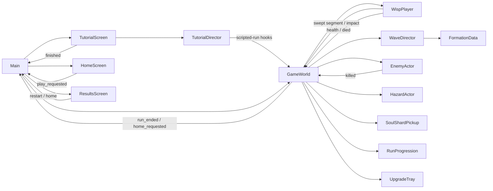

# Wisp Rush — Project Context

> **The canonical map of this project for humans and AI agents.** Read it before changing
> anything, and keep it true: if your change makes a line here wrong, fixing that line is part of
> the change. This file holds **meaning and intent**; the exhaustive, auto-generated inventory of
> what exists is [generated/PROJECT_MAP.md](generated/PROJECT_MAP.md).

_Last updated: 2026-09-30 · by: Claude Code (Opus 5.5)_

## 1. Identity

| Field | Value |
|---|---|
| Game | **Wisp Rush** — swipe-to-dash portrait survival action game (see [GDD.md](GDD.md)) |
| Engine | Godot **4.7.2-stable**, standard build, **GDScript only** |
| Editor binary | `/Users/dimitarslezenkovski/Desktop/Godot.app/Contents/MacOS/Godot` |
| Project root | repository root — `res://` = repo root, `project.godot` lives here |
| Renderer | Forward+ (default; revisit once art direction and platforms are known) |
| Genre · platforms · resolution | Survival arcade roguelite · Android/iOS + desktop debug · 1080×1920 design coordinates, expanding full-bleed viewport · **portrait only, locked, never landscape** (owner, 2026-10-02; `display/window/handheld/orientation=1`) |
| Art style | **2D pixel art** (owner, 2026-09-24, [ADR-0018](decisions/0018-pixel-art-direction.md)): pixel grid, limited palettes, nearest filtering, no painterly art, and no 3D art except arenas, which may be 3D (owner, 2026-09-30, [ADR-0023](decisions/0023-3d-arenas.md)); painted assets are legacy until redrawn. Characters are drawn exactly like Patchvile: no outline, AutoSprite's colours and soft edges (GDD §14 #46) |
| Main scene | `res://scenes/main/main.tscn` (Home/gameplay scene host) |

## 2. Current status

- **Phase:** M10 (Endless, Rift Points Shop; its story Rifts were removed 2026-09-25), M11 (RUSH) and M12 (Tutorial) built 2026-09-15,
  implementation only; runs on the owner's Android phone from a debug APK.
- **Works:** Loading → Tutorial (first launch) → animated Home → Endless runs (bosses;
  three painted arenas, the Quarry Titan, Stitched Doll Jungle and Chained Colossus, plus the layered Stitchwarden's Vigil, the 3D Chained Colossus 3D and the 3D ZOOM ARENA, which opens with a zoom into its floor) → Results with a Rift Points breakdown; Trials, Daily, three-tab RP Shop (No Ads disabled); the story Rifts were removed on 2026-09-25 (docs keep them as history);
  **six characters** (roster cut 2026-09-25: Void, Eclipse, Veyra and Noxen removed; Mothmere added the same day;
  Scarlet replaced Ilyra 2026-09-26) — one rig (Morrow), **Rook** (AutoSprite, 2026-09-27, his rig removed), **Scarlet** (AutoSprite, 2026-09-26),
  **Shade** (`verdant_shade`, rebuilt on AutoSprite 2026-09-25), **Mothmere** (AutoSprite, 2026-09-25), and **Patchvile** (AutoSprite, **owner-approved**, the worked example and the **default character**); save v9;
  synthesized audio; Reduced Motion; simulation follows the
  screen's refresh rate; Android back.
  No character plays a menu video since 2026-09-26 (ADR-0016). No character tiers (2026-09-26).
  40 headless test scripts (`tools/run_tests.sh`), 7 stale since M10.
- **Direction:** [ADR-0013](decisions/0013-rift-story-levels-endless-mode-and-rift-points.md) /
  [ADR-0014](decisions/0014-endless-arenas-share-one-floor-template.md), built from
  [specs/story_and_endless/](specs/story_and_endless/README.md) (specs 01–05 done).
- **Next:** the roster rework onto the AutoSprite recipe. **Shade** is in (2026-09-25), for the owner's
  phone test. **Scarlet** replaced Ilyra (2026-09-26, GDD §14 #52) and is in, for the owner's phone
  test. **Rook** is in (2026-09-27, GDD §14 #55–56): his five AutoSprite sheets, cleaned and packed, replace his
  bone rig, for the owner's phone test. **Enemies v2** (M14): the first boss, **Grimgrin**, is in
  (2026-09-27, the first boss of every Endless run), and the owner's **five enemies** replace every old
  enemy (2026-09-28, GDD §14 #62; the old bosses stay for now), for the owner's phone test. Then owner review of the pixel UI, font and HUD on the phone;
  prices for every character (still 0); then the device pass and M9/M6
  ([ROADMAP.md](ROADMAP.md)).

Keep this section ≤ 10 lines. Details belong in ROADMAP.md and DEVLOG.md.

## 3. Repository map

```
.
├── project.godot      Engine settings: autoloads, input map, layer names, main scene
├── icon.svg           Project icon
├── AGENTS.md          Operating manual for ANY AI agent — read first
├── CLAUDE.md          Claude Code entry point (imports AGENTS.md)
├── README.md          Human quick start
├── .mcp.json          MCP servers for Claude Code (Godot)
├── .claude/           Claude Code: settings.json, agents/ (subagents), skills/ (workflows)
├── concept_art/       Art source packs + generation prompts (read-only sources; not runtime) — ADR-0005, ADR-0014
├── addons/            Third-party Godot plugins — never edit by hand
├── assets/            Raw media: art/, audio/{music,sfx}/, fonts/, shaders/ — see docs/ASSETS.md
├── scenes/            One folder per feature: <thing>.tscn + <thing>.gd side by side
│   └── main/          Bootstrap entry scene
├── scripts/           Code not owned by a single scene
│   ├── autoload/      Global singletons (registered in project.godot + §5.3)
│   ├── components/    Reusable node components (health, hitbox, movement…)
│   ├── resources/     Custom Resource classes (data schemas, class_name'd)
│   └── utils/         Static helpers
├── data/              .tres instances of custom resources (tuning, levels, waves)
│   (assets/art/ is GENERATED by tools/art/; assets/ui/theme/ holds the project Theme;
│    assets/legacy_v1/ is the ignored archive of the previous art)
├── tests/             Reserved for a test framework (ROADMAP backlog); headless tests are tools/godot/test_*.gd
├── docs/              All documentation (.gdignore'd — invisible to Godot); docs/specs/ = agent work
│                   orders, docs/guides/ = how-to recipes for repeatable jobs
└── tools/             Dev tooling (.gdignore'd)
    ├── validate.sh    Headless check (import, parse, boot, refresh map)
    ├── run_tests.sh   Runs every tools/godot/test_*.gd headless
    ├── qa_matrix.sh   Phone layout QA across five aspect ratios
    ├── project_map.mjs  Generates docs/generated/PROJECT_MAP.md
    ├── screenshot.sh  Renders N frames → logs/screenshot.png
    ├── godot/         GDScript tools run with --script (check_scripts, test_*, render_* fixtures)
    ├── art/           Python art pipeline: redesign extraction, painted arenas (make_arena), the playable-character
    │                  chain (make_rig_source → extract_playable_characters → build_character_rig),
    │                  and menu videos (extract_menu_video)
    │                  — ADR-0005, ADR-0014, ADR-0015, docs/guides/character_rig_recipe.md
    │                  and docs/guides/character_creation.md (whole-frame characters)
    ├── video/         Devlog video helpers (Kokoro TTS, graphics, Palmier motion)
    └── mcp/           Pinned Godot MCP server (npm; node_modules git-ignored) — ADR-0002
```

Machine-local / generated, never edit: `.godot/` (engine cache), `logs/` (validator output),
`*.import` (edit via editor/MCP only). `*.uid` files are generated by Godot but **are committed**.
`video/` is the git-ignored devlog video workspace (footage, voiceover, exports) — [tools/video/README.md](../tools/video/README.md).

## 4. Architecture

`Main` is the composition root. It swaps self-contained Home, GameWorld and Results scenes in
response to upward signals and banks runs, rewards and Rift Points through the SaveManager autoload. GameWorld owns run statistics, combat routing, responsive
arena and HUD; the TutorialScreen hosts a scripted GameWorld driven by its TutorialDirector. WaveDirector requests deterministic, threat-budgeted FormationData; GameWorld
realizes them through EnemyActor and HazardActor prefabs. RunProgression owns XP and safe mutation
choices while GameWorld applies their effects. WispPlayer owns gesture/dash and health presentation,
then reports events upward. Balance lives in typed Resources under `data/`. Global services are the
three autoloads in §5.3, each backed by an ADR.


```mermaid
flowchart LR
  Main --> TutorialScreen
  TutorialScreen --> TutorialDirector
  TutorialDirector -- scripted-run hooks --> GameWorld
  TutorialScreen -- finished --> Main
  Main --> HomeScreen
  HomeScreen -- play_requested --> Main
  Main --> GameWorld
  Main --> ResultsScreen
  GameWorld --> WispPlayer
  GameWorld --> WaveDirector
  WaveDirector --> FormationData
  GameWorld --> EnemyActor
  GameWorld --> HazardActor
  GameWorld --> SoulShardPickup
  GameWorld --> RunProgression
  GameWorld --> UpgradeTray
  WispPlayer -- swept segment / impact --> GameWorld
  WispPlayer -- health / died --> GameWorld
  EnemyActor -- killed --> GameWorld
  GameWorld -- run_ended / home_requested --> Main
  ResultsScreen -- restart / home --> Main
```

**Defaults** (apply unless an ADR overrides them; details in [CONVENTIONS.md](CONVENTIONS.md)):
- Composition over inheritance — behaviour as child component nodes.
- Call down, signal up. Cross-tree communication through an `EventBus` autoload (created when
  first needed; declares signals only).
- Tuning values in Resources under `data/`, never magic numbers in logic.
- Autoloads only for global services (EventBus, GameState, Audio, SceneLoader).

## 5. Registries

Hand-maintained tables that give **meaning** to what the project map lists. Keep them in sync with
`project.godot` and code in the same change (see §7.2).

### 5.1 Systems
| System | Status | Doc | Entry point |
|---|---|---|---|
| Game flow | ✅ done | [game_flow.md](systems/game_flow.md) | `res://scenes/main/main.tscn` |
| Player dash | ✅ done | [player_dash.md](systems/player_dash.md) | `res://scenes/player/wisp_player.tscn` |
| Player health | ✅ done | [player_health.md](systems/player_health.md) | `res://scripts/components/health_component.gd` |
| Core run | ✅ done | [core_run.md](systems/core_run.md) | `res://scenes/gameplay/game_world.tscn` |
| Enemies | 🔄 Enemies v2: Bone Witch, Claw Ghost, Hooded Scribe, Root Mask, Stone Golem in the game 2026-09-28, every old enemy removed · owner phone test pending | [enemies.md](systems/enemies.md) | `res://scripts/components/whole_frame_enemy.gd` |
| Tutorial | ✅ Tutorial screen, nine show-then-try lessons · device pass pending | [tutorial.md](systems/tutorial.md) | `res://scenes/tutorial/tutorial_screen.tscn` |
| Wave director | ✅ done | [wave_director.md](systems/wave_director.md) | `res://scenes/gameplay/wave_director.gd` |
| Arena hazards | ✅ done | [hazards.md](systems/hazards.md) | `res://scripts/components/hazard_actor.gd` |
| Run progression | ✅ done | [mutations.md](systems/mutations.md) | `res://scripts/components/run_progression.gd` |
| Reaper boss | ✅ done | [reaper_boss.md](systems/reaper_boss.md) | `res://scenes/bosses/reaper_boss.tscn` |
| Grimgrin boss | 🔄 in game 2026-09-27: the first Enemies v2 boss, the first boss of every Endless run · owner phone test pending | [grimgrin_boss.md](systems/grimgrin_boss.md) | `res://scenes/bosses/grimgrin_boss.tscn` |
| Save manager | ✅ done | [save_manager.md](systems/save_manager.md) | `res://scripts/autoload/save_manager.gd` |
| Cosmetic forms | ✅ done · six characters in the Shop's CHARACTERS tab (Patchvile, the default, Shade, Scarlet, Morrow, Rook, Mothmere; Void, Eclipse, Veyra and Noxen removed and Mothmere added 2026-09-25; Ilyra replaced by Scarlet 2026-09-26); no tiers (2026-09-26) | [forms.md](systems/forms.md) | `res://data/forms/default_catalog.tres` |
| Playable characters | ✅ one rig (Morrow), and **Patchvile** (the default), **Shade**, **Mothmere**, **Scarlet** and **Rook** (2026-09-27, his rig removed) on the AutoSprite recipe. Roster cut to five 2026-09-25, then Mothmere made six; Scarlet replaced Ilyra 2026-09-26; new characters are whole-frame sprites, not rigs, and a drawn character is **five animations** — dash, three wall loops, one storefront idle (GDD §14 #36). **New characters: [character_creation.md](guides/character_creation.md)**, the AutoSprite recipe, with Patchvile's pixel count for everyone (194 px standing in the 256 px frame, `roster_scale`, 2026-09-24) and the same size everywhere (GDD §14 #54; Scarlet is drawn 1.16× larger to match); no character plays a menu video since 2026-09-26 ([ADR-0016](decisions/0016-menu-videos-for-character-storefronts.md); Shade until 2026-09-25, Ilyra until she was removed); no bounce on pick, buy or equip (#38) · owner approval, prices and device pass pending | [playable_character_visuals.md](systems/playable_character_visuals.md) | `res://scenes/player/visuals/playable_character_visual.gd` |
| Daily/challenges | ✅ done | [challenges.md](systems/challenges.md) | `res://scripts/utils/challenge_tracker.gd` |
| Audio | ✅ done | [audio.md](systems/audio.md) | `res://scripts/autoload/audio_service.gd` |
| Game feel & lifecycle | ✅ done · simulation rate follows the display (`FramePacing`) | [game_feel.md](systems/game_feel.md) | `res://scenes/gameplay/game_world.gd` |
| RUSH mode and fast feel | ✅ done · device pass pending | [rush_mode.md](systems/rush_mode.md) | `res://data/feel/default_run_feel_tuning.tres` |
| Settings & statistics | ✅ done | [settings.md](systems/settings.md) | `res://scenes/screens/settings_screen.tscn` |
| UI design system | ✅ done · pixel UI kit integrated 2026-09-24 (theme generated from `concept_art/wisp_rush_pixel_ui_v1/`, nearest-filtered wrappers) · owner phone review pending | [ui_design_system.md](systems/ui_design_system.md) | `res://assets/ui/theme/wisp_theme.tres` |
| Rifts | ⛔ removed 2026-09-25 (owner): story mode, Rift Map, the five Rifts and their twists; Endless keeps their enemy mixes and bosses as `EndlessRoster`s. The page is history | [rifts.md](systems/rifts.md) | — |
| Endless mode | ✅ three painted arenas: the Quarry Titan, the Stitched Doll Jungle and the Chained Colossus (own floors, ADR-0020); one layered arena: Stitchwarden's Vigil (ADR-0021, revised art and floor ADR-0022); one 3D arena: the Chained Colossus 3D (ADR-0023), and the 3D ZOOM ARENA test slot, the same scene with a zoom intro (2026-10-01) · owner phone test pending; the thirty skins removed 2026-09-23 (ADR-0017, [arena_art.md](guides/arena_art.md)) · the Quarry Titan's 1080×2400 re-delivery and device pass pending | [endless_mode.md](systems/endless_mode.md) | `res://data/endless/default_endless_catalog.tres` |
| Shop & Rift Points | ✅ Rift Points (spec 01), three-tab Shop (DASHES removed 2026-09-19) | [shop.md](systems/shop.md) | `res://scenes/screens/shop_screen.tscn` |
| Trials and depth milestones | ✅ done | [meta_progression.md](systems/meta_progression.md) | `res://scenes/screens/trials_screen.tscn` |
| Monetisation | 🔄 plumbing only | [monetisation.md](systems/monetisation.md) | `res://scripts/autoload/monetisation_service.gd` |

### 5.2 Key scenes
Only entry points, levels and major reusable prefabs — the map lists every scene.

| Scene | Purpose | System |
|---|---|---|
| `res://scenes/main/main.tscn` | Composition root: Loading, Tutorial, Home, Shop, Daily, Trials, Statistics, Settings, GameWorld or Results; back routing | Game flow |
| `res://scenes/screens/home_screen.tscn` | Home: top bar (Rift Points, best), tappable live hero character (→ Shop CHARACTERS) over a living background between Trials/Daily and Shop/Remove Ads columns, the ENDLESS caption and an animated PLAY under it (no RIFTS in the first release) | Game flow |
| `res://scenes/screens/shop_screen.tscn` | The only place RP is spent: tabs CHARACTERS (animated cards), ARENAS (the same card pager, each arena whole, buy/equip) and NO ADS (Remove Ads + Restore, disabled until billing exists, no RP; ADR-0012, ADR-0013) | Shop / Monetisation |
| `res://scenes/gameplay/game_world.tscn` | Responsive playable arena and run-local coordinator | Core run |
| `res://scenes/player/wisp_player.tscn` | Aiming, dash, health and death player prefab; hosts the equipped character's rig | Player dash / health |
| `res://scenes/player/visuals/morrow_visual.tscn` | The one remaining animated character rig on the shared `PlayableCharacterVisual` base (ADR-0015) | Playable characters |
| `res://scenes/player/visuals/rook_visual.tscn` | Rook (2026-09-27), on the AutoSprite recipe in place of his bone rig (removed): AutoSprite's storefront, floor, his own ceiling, right wall (left = mirrored) and a one-shot dash attack (push, dive, tail-blade swing), sliced and cleaned by his pack's slicer; 336 px run cells, `design_size` 336, `art_scale` 1.55859375, so he is everyone's size; his rig's dash look kept (streaks, dust trail, mote ring, `DUST_WAKE`, no attack glow) | Playable characters |
| `res://scenes/player/visuals/scarlet_visual.tscn` | Scarlet (2026-09-26), on the AutoSprite recipe, in place of Ilyra (removed): AutoSprite's storefront (breathing, one fan wave), floor, right wall (left = mirrored, ceiling = floor flipped) and a one-shot dash attack (a fan swing drawing an airy blue reap), sliced and cleaned by her pack's slicer, her sheets at 166 px standing, drawn 1.16× larger (`art_scale` 1.38, `menu_art_scale` 1.45) so she is the same size as everyone (GDD §14 #54); her dash throws her own reap crescents and trails her crown diamond; pale blue attack look, a twin-arc dash signature, splash landing | Playable characters |
| `res://scenes/player/visuals/whole_frame_character_visual.gd` | `WholeFrameCharacterVisual`: the shared behaviour of every whole-frame character — two on-demand frame sets, screen-space walls, mirrored right wall, menu rest, and the map from the thirteen-state vocabulary onto the five drawn animations (owner, 2026-09-20) | Playable characters |
| `res://scenes/player/visuals/verdant_shade_visual.tscn` | Shade, rebuilt on the AutoSprite recipe (2026-09-25): AutoSprite's storefront, floor, right wall (left = mirrored), ceiling and one-shot dash attack at Patchvile's scale; its menus play the storefront, not the old video; leaf dash particles, green attack look, dust landing | Playable characters |
| `res://scenes/player/visuals/mothmere_visual.tscn` | Mothmere (2026-09-25), on the AutoSprite recipe: AutoSprite's storefront (the staff strikes the floor), floor, right wall (left = mirrored, ceiling = floor flipped) and a one-shot dash attack (a staff swing drawing a red reap) at Patchvile's scale; keeps the outline of his source images (GDD §14 #49); red attack look and red trail particles, dust landing | Playable characters |
| `res://scenes/player/visuals/patchvile_visual.tscn` | Patchvile, **owner-approved** and the worked example of [character_creation.md](guides/character_creation.md): all AutoSprite — storefront, floor, right wall and the one-shot dash attack (ceiling = floor flipped, left = right mirrored); 256 px run cells, 336 px dash cells, `design_size` 256 | Playable characters |
| `res://scenes/arenas/chained_colossus_3d.tscn` | The first 3D arena (ADR-0023): the owner's model with a breathing head, live in a SubViewport over a night sky of clouds, with blue ghost fire, skulls and floating shards; a `ModelArenaVisual`, hosted by GameWorld as an `ArenaVisual`. `zoom_arena_3d.tscn` is the same scene with `zoom_intro` on: each run opens on the whole arena and zooms in until its floor fills the whole screen; a restart from the run's dialogs starts zoomed in (2026-10-01, 2026-10-02) | Endless mode |
| `res://scenes/enemies/claw_ghost.tscn` | Melee: closes in from the side and swipes (Enemies v2) | Enemies |
| `res://scenes/enemies/root_mask.tscn` | Melee: lunges from a short distance; drawn from above (Enemies v2) | Enemies |
| `res://scenes/enemies/hooded_scribe.tscn` | Shooter: a rune that follows the Wisp for 2.5 s; the Tutorial's target (Enemies v2) | Enemies |
| `res://scenes/enemies/bone_witch.tscn` | Shooter: a bolt that leaves a purple wall mark (Enemies v2) | Enemies |
| `res://scenes/enemies/stone_golem.tscn` | Shooter: a straight stone shard (Enemies v2) | Enemies |
| `res://scenes/hazards/split_void_crystal.tscn` | Indestructible dash-blocking obstacle prefab | Arena hazards |
| `res://scenes/hazards/spike_bloom.tscn` | Cycled area-danger prefab | Arena hazards |
| `res://scenes/hazards/blade_ring.tscn` | Rotating blade-tip danger prefab | Arena hazards |
| `res://scenes/pickups/soul_shard_pickup.tscn` | Rift Points shard drop and attraction prefab (keeps the shard file name) | Run progression |
| `res://scenes/gameplay/dash_effect_fx.tscn`-less `dash_effect_fx.gd` | `DashEffectFx`: the pool that draws a dash signature (Line2D ribbons + CPUParticles2D sparks), a sibling of `EffectsLayer` beside `VfxPool` | Player dash |
| `res://scenes/gameplay/upgrade_tray.tscn` | Bottom three-card upgrade tray shown at calm moments over the slowed, live run (no pause) | Run progression |
| `res://scenes/tutorial/tutorial_screen.tscn` | Tutorial screen: scripted placeholder arena, ghost-hand lessons, step counter, SKIP confirm (first launch; replay from Settings) | Tutorial |
| `res://scenes/screens/results_screen.tscn` | Score, run statistics, Rift Points breakdown (collected, performance, rewards, total, balance) and navigation | Game flow |
| `res://scenes/bosses/reaper_boss.tscn` | Recurring three-phase Reaper encounter prefab | Reaper boss |
| `res://scenes/bosses/grimgrin_boss.tscn` | Grimgrin, the Hollow Ronin: the wall-to-wall melee boss; a `BossActor` like the Reaper | Grimgrin boss |
| `res://scenes/screens/daily_screen.tscn` | Daily run (Endless rules) arena of the day, seed, best, reward and three challenges | Daily/challenges |
| `res://scenes/screens/loading_screen.tscn` | Boot: streams screens and waits for audio synthesis (≤ 6 s) | Game flow |
| `res://scenes/screens/settings_screen.tscn` | Settings, Privacy & About, armed reset; also the in-run overlay | Settings & statistics |
| `res://scenes/screens/statistics_screen.tscn` | Lifetime statistics | Settings & statistics |
### 5.3 Autoloads
| Name | Script | Responsibility |
|---|---|---|
| `SaveManager` | `res://scripts/autoload/save_manager.gd` (`SaveManagerService`) | Versioned local progression: validation, migration, atomic save + backup; automated runs use `user://test_runs/` ([ADR-0003](decisions/0003-save-manager-autoload.md)) |
| `Audio` | `res://scripts/autoload/audio_service.gd` (`AudioService`) | Runtime-synthesized SFX and layered music on Master/Music/SFX/UI buses; call through `SoundFx` ([ADR-0004](decisions/0004-runtime-synthesized-audio.md)) |
| `Monetisation` | `res://scripts/autoload/monetisation_service.gd` (`MonetisationService`) | Opt-in rewarded placements and the Remove Ads product behind an injected `AdProvider`; ships with `NullAdProvider`, so nothing is offered ([ADR-0009](decisions/0009-monetisation-model.md)) |

### 5.4 Input actions
| Action | Default bindings | Meaning |
|---|---|---|
| `move_left` | A, Left | Aim left (desktop QA) |
| `move_right` | D, Right | Aim right (desktop QA) |
| `move_up` | W, Up | Aim up (desktop QA) |
| `move_down` | S, Down | Aim down (desktop QA) |
| `dash` | Space | Launch along the keyboard aim vector |
| `pause` | Escape | Open or close the topmost pause overlay |

### 5.5 Physics layers
| Layer | Name | Used by |
|---|---|---|
| _none yet_ | | |

### 5.6 Groups
| Group | Members | Used for |
|---|---|---|
| `enemies` | The five Enemies v2 prefabs | Focus, contact and combat queries |
| `hazards` | Crystal, bloom and blade-ring prefabs | Focus, dash blocking and danger queries |
| `pickups` | Soul Shard pickup prefab | Dash collection and attraction queries |
| `bosses` | Boss prefabs (Reaper, Grimgrin) | Boss-only queries during the recurring encounter |

### 5.7 Global signals (EventBus)
| Signal | Args | Emitted by | Listened by |
|---|---|---|---|
| _none yet_ | | | |

### 5.8 Data resource types
| Class | Script | Instances in | Purpose |
|---|---|---|---|
| `PlayerTuning` | `res://scripts/resources/player_tuning.gd` | `res://data/player/default_player_tuning.tres` | Dash, input, health and impact starting values |
| `EnemyTuning` | `res://scripts/resources/enemy_tuning.gd` | `res://data/enemies/{bone_witch,claw_ghost,hooded_scribe,root_mask,stone_golem}.tres` | Enemy health, movement, threat and rewards, and the Enemies v2 attack (range, kept distance, strike, shots, wall mark); Claude's values for the phone test |
| `FormationData` | `res://scripts/resources/formation_data.gd` | `res://data/formations/*.tres` | Normalized authored encounter: where enemies arrive (every slot `enemy` since 2026-09-28; the `EnemyRamp` picks who) and an optional hazard |
| `FormationCatalog` | `res://scripts/resources/formation_catalog.gd` | `res://data/waves/default_catalog.tres` | Ordered complete formation registry |
| `WaveTuning` | `res://scripts/resources/wave_tuning.gd` | `res://data/waves/default_wave_tuning.tres` | Wave duration, budget and spawn cadence; the Enemies v2 ramp (kinds at start, waves per new kind) |
| `HazardTuning` | `res://scripts/resources/hazard_tuning.gd` | `res://data/hazards/*.tres` | Hazard scale, collision and cycle timing |
| `MutationData` | `res://scripts/resources/mutation_data.gd` | `res://data/mutations/*.tres` (6) | Mutation identity, cap, value, copy and icon. SOUL VESSEL left the tray on 2026-09-19 and the game on 2026-09-24, and REAPER'S GIFT left on 2026-09-24 (a one-fragment run has nothing to heal) |
| `RunProgressionTuning` | `res://scripts/resources/run_progression_tuning.gd` | `res://data/progression/default_run_progression.tres` | XP curve, shared mutation-effect tuning and the upgrade offer (tray slow motion, timeout, slide, calm window, indicator pulse) |
| `ReaperTuning` | `res://scripts/resources/reaper_tuning.gd` | `res://data/bosses/default_reaper.tres`, `res://data/bosses/*_tuning.tres` | Reaper health, phase timings, attack geometry and rewards (one per boss variant) |
| `BossData` | `res://scripts/resources/boss_data.gd` | `res://data/bosses/{reaper,reaper_ascended,hollow_choir,the_fracture,cinder_maw,grimgrin}.tres` | One boss variant on the shared `ReaperBoss` machine: atlas, toughness, accent; referenced by `EndlessRoster.boss_id` ([ADR-0010](decisions/0010-data-driven-boss-variants.md)). A boss with its own `scene` (Grimgrin) plays that instead, with its approach callout ([ADR-0019](decisions/0019-bosses-with-their-own-scene.md)) |
| `GrimgrinTuning` | `res://scripts/resources/grimgrin_tuning.gd` | `res://data/bosses/grimgrin_tuning.tres` | Grimgrin's size, health, rests, dash warning and speed, the fast attack (2026-09-28), ill wall, Death's Grin, spawns and rewards (Claude's starting values for the phone test) |
| `BossSpriteLayout` | `res://scripts/resources/boss_sprite_layout.gd` | `res://data/bosses/grimgrin_layout.tres` (generated) | Where a whole-frame boss's feet and wall grip sit in its packed frames, measured by its packer |
| `FormData` | `res://scripts/resources/form_data.gd` | `res://data/forms/*.tres` (6) | Character identity, price, requirement, portrait, tint and optional `visual_scene` rig; no tier since 2026-09-26 |
| `MenuVideoData` | `res://scripts/resources/menu_video_data.gd` | none in use: `verdant_shade_menu_video.tres` is kept, but no scene uses it since 2026-09-25; Ilyra's was removed with her 2026-09-26 | A character's menu performance as a pre-rendered packed-alpha Theora video: stream, the square it is drawn in, and the measured matte floor/ceiling ([ADR-0016](decisions/0016-menu-videos-for-character-storefronts.md)) |
| `CharacterPoseSheet` | `res://scripts/resources/character_pose_sheet.gd` | `res://data/characters/{verdant_shade,patchvile,mothmere,scarlet,rook}_frames.tres` (generated) | The silhouette drift each whole-frame character's frames were measured at (the tests read it); its per-pose offset and scale were Ilyra's |
| `FormCatalog` | `res://scripts/resources/form_catalog.gd` | `res://data/forms/default_catalog.tres` | Ordered six-character registry (`REQUIRED_FORM_COUNT`), the default form (`DEFAULT_FORM_ID`, Patchvile) and validation |
| `DashEffectData` | `res://scripts/resources/dash_effect_data.gd` | `res://data/characters/dash_effects/*.tres` (6) | One character's dash signature: shape (six `Signature` values), tints, spark count, ribbon width and life, and how far it turns the shared launch burst down. Cosmetic only; validated against the reserved hues |
| `DashStyleData` | `res://scripts/resources/dash_style_data.gd` | `res://data/dash_styles/*.tres` | Dash style: id, name, price, `trail_tint`, `burst_tint`, `uses_form_tint`; reserved-hue check |
| `DashStyleCatalog` | `res://scripts/resources/dash_style_catalog.gd` | `res://data/dash_styles/default_dash_style_catalog.tres` | Ordered dash styles (SOUL free default), lookup, save ids, validation |
| `ArenaSkinData` | `res://scripts/resources/arena_skin_data.gd` | `res://data/endless/skins/*.tres` (6) | One Endless arena: id, name, tier, price, accent, lazy `background_path`, `thumbnail`, optional `scenery`, `placeholder`, an optional own `floor_rect` (ADR-0020; none = the shared floor, ADR-0017) and an optional layered or 3D scene, `visual_scene_path` (ADR-0021, ADR-0023) |
| `ArenaSceneryData` / `ArenaSceneryZone` / `ArenaParticleEmitter` | `res://scripts/resources/arena_scenery_data.gd` / `arena_scenery_zone.gd` / `arena_particle_emitter.gd` | none since 2026-09-23 (they were sub-resources of the removed Legendary/Mythic skins) | Animated scenery an arena may carry: mask, grade, set piece, sweep, shooting stars · light + distortion of one mask zone · one glow-particle stream; run by `ArenaAmbience` + `arena_scenery.gdshader` |
| `ModelArenaLayout` | `res://scripts/resources/model_arena_layout.gd` | `res://assets/art/environment/arenas/chained_colossus_3d/chained_colossus_layout.tres` (generated) | Where a 3D arena's model has its floor, eye, flames and skulls, measured by its build script (ADR-0023) |
| `EndlessTuning` | `res://scripts/resources/endless_tuning.gd` | `res://data/endless/default_endless_tuning.tres` | Endless boss cadence, per-cycle threat and enemy speed, fixed daily pool (`daily_roster_ids`, `daily_boss_ids`), the Endless opening boss (`opening_boss_id`) |
| `EndlessCatalog` | `res://scripts/resources/endless_catalog.gd` | `res://data/endless/default_endless_catalog.tres` | The shared floor (`floor_rect`, `floor_polygon`), arenas, default arena, tuning, the rosters (`rosters`) that carry the boss pool; arena of the day; validation |
| `EndlessRoster` | `res://scripts/resources/endless_roster.gd` | `res://data/endless/rosters/*.tres` (5) | One Endless boss-pool entry: the old enemy mix's id and name and the boss it brings. Moved out of the story Rifts on 2026-09-25; its enemy swaps and callout went with Enemies v2 (2026-09-28) |
| `EconomyTuning` | `res://scripts/resources/economy_tuning.gd` | `res://data/economy/default_economy_tuning.tres` | Rift Points payouts that are not pickups: `score_per_rift_point` performance bonus; `placeholder` until calibrated on a device |
| `RunFeelTuning` | `res://scripts/resources/run_feel_tuning.gd` | `res://data/feel/default_run_feel_tuning.tres` | Visible momentum, shard sweep, slow-motion finisher and RUSH meter/mode values (GDD §5.6, §14 #27) |
| `TutorialLessonData` / `TutorialCatalog` | `res://scripts/resources/tutorial_lesson_data.gd` / `tutorial_catalog.gd` | `res://data/tutorial/default_tutorial.tres` | Tutorial lessons (captions, goal, placements, demo swipes, XP/RUSH switches, upgrade tap demo), placeholder arena skin id, boss health and timings |
| `TrialData` / `TrialCatalog` | `res://scripts/resources/trial_data.gd` / `trial_catalog.gd` | `res://data/trials/*.tres` | Trials ladder goals, Rift Points rewards and the 12-tier catalog |

## 6. Tooling

| Task | How |
|---|---|
| Full headless check (import → parse all scripts → boot main scene → refresh map) | `tools/validate.sh` |
| Refresh the project map | `node tools/project_map.mjs` |
| Is the map current? | `node tools/project_map.mjs --check` |
| Run all headless tests (per-test timeout, logs in `logs/tests/`) | `tools/run_tests.sh [name-filter]` |
| Visual QA fixtures (render with `--write-movie`; usage in each file header) | `tools/godot/render_*_showcase.gd` |
| Performance overlay in a running debug build | press F3 |
| Phone layout QA: screens × 5 phone aspect ratios → `logs/qa/<screen>_sheet.png` | `tools/qa_matrix.sh [screens…]` |
| Frame-time benchmark (crowded run) | `Godot --headless --path . --script res://tools/godot/bench_stress.gd` |
| Regenerate runtime art from the redesign sheets | `python3 tools/art/extract_redesign.py`, then `tools/validate.sh` |
| Regenerate the playable-character layers (and print their ribbon spines) | `python3 tools/art/extract_playable_characters.py morrow` (name them: an all-characters run rewrites the older extracts on this machine), then `tools/validate.sh` |
| Turn a generated storefront video into the game's looping, transparent menu video (loop seam, per-character magenta or green key, label mask, packed alpha, Theora via Godot's Movie Maker) | `GODOT_PATH=<editor binary> python tools/art/extract_menu_video.py [id]` → `assets/art/characters/playable/<id>/<id>_menu.ogv` + `data/characters/<id>_menu_video.tres`; QA in `logs/menu_video/`. Opens a window for a few seconds ([ADR-0016](decisions/0016-menu-videos-for-character-storefronts.md)) |
| Import a painted Endless arena (background + Shop thumbnail, prints its floor in UV) / draw the arena layout guide | `python tools/art/make_arena.py <id>` / `--guide`, then `tools/validate.sh` and `tools/run_tests.sh endless_catalog` ([arena_art.md](guides/arena_art.md)) |
| Build a 3D arena's model (lighter, head rig, GLB + `ModelArenaLayout`) / render an arena scene's Shop still | `"D:/Blender/blender.exe" --background --factory-startup --python concept_art/arenas_v2/chained_colossus_3d/build_colossus.py` / `"$GODOT" --path . --script res://tools/godot/render_arena_still.gd -- scene=res://scenes/arenas/<id>.tscn out=concept_art/arenas_v2/<id>/source.png` (a window), then `make_arena.py <id>` ([arena_art.md](guides/arena_art.md) §5, ADR-0023) |
| Rebuild the game icon and splash art | `python concept_art/wisp_rush_home_pixel_v1/repair_logo_face.py` → `python tools/art/extract_redesign.py --only brand_logo --no-contact` for the Home/loading logo; `python concept_art/wisp_rush_app_icon_pixel_v1/build_icon_v4.py` → `python tools/art/make_app_icon.py` for the v4 project/Android launcher icons and separate smaller Godot/Android splash logos; then `tools/validate.sh`. Both source builders apply the reference-matched brown cloth face; `project.godot` and `export_presets.cfg` point to the generated files |
| Repack a whole-frame character's sheets and regenerate its `SpriteFrames` | `python3 tools/art/extract_playable_characters.py <id>` (`verdant_shade`, `patchvile`, `mothmere`, `scarlet`, `rook`; Scarlet's and Rook's frames are first cut and cleaned by their pack's `slice_sheet.py`), then `tools/validate.sh`. A pack's `fit` option scales and centres art drawn too small in its canvas |
| Character visual QA: reference vs rig, motion frames, Shop/Home/gameplay shots | `tools/godot/render_character_{lineup,motion,select_showcase,home_showcase,gameplay_showcase}.*` + `python3 tools/art/motion_contact_sheet.py <id>` ([playable_character_visuals.md](systems/playable_character_visuals.md)) |
| What live character previews cost to build and run | `Godot --headless --path . --script res://tools/godot/bench_character_previews.gd` |
| Rebuild the UI Theme | steps in [ui_design_system.md](systems/ui_design_system.md) |
| Build + deploy the Android debug APK (device over USB) | `JAVA_HOME=$(/usr/libexec/java_home) "$GODOT" --headless --path . --export-debug "Android" build/android/wisp_rush_debug.apk` then `~/Library/Android/sdk/platform-tools/adb install -r -t build/android/wisp_rush_debug.apk` and `adb shell monkey -p com.cognitix.wisprush -c android.intent.category.LAUNCHER 1` (the activity is `GodotAppLauncher` and is **not exported**, so `am start -n` is denied) |
| Render at an explicit window aspect | `tools/screenshot.sh [scene] [frames] [size]` (PNG remains at design resolution; runtime log reports the expanded arena) |
| TikTok / Shorts devlog videos: bot-played capture, Kokoro voices + captions, game sounds, graphic pieces, edit in Palmier Pro (MCP) | recipe [marketing/devlog_video_recipe.md](marketing/devlog_video_recipe.md); hooks [marketing/devlog_hooks.md](marketing/devlog_hooks.md); commands [tools/video/README.md](../tools/video/README.md) (`tools/godot/{render_gameplay_clip,render_devlog_tour,render_arena_showcase,render_feel_showcase,export_game_audio}.gd`, `tools/video/{kokoro_tts,devlog_graphics,palmier_motion}.py`) |
| Run the game / open the editor / drive Godot from an agent | See [AGENTS.md](../AGENTS.md) §4 (commands + Godot MCP) |

## 7. Documentation rules

These rules exist so any agent, in any session, can answer "what is this, where is it, why is it
like this" in minutes. **A change is not done until its documentation is.**

**Strict (owner, 2026-09-25; [AGENTS.md](../AGENTS.md) §0):** write into the docs only what the owner
said or decided, or what was actually done or measured. Never invent a rule, requirement, value or
plan. If you are not certain whether something belongs in the docs, or what it should say, ask the
owner before writing it.

### 7.1 One fact, one home
| Question | Authoritative file |
|---|---|
| How do agents work in this repo? | `AGENTS.md` (+ `CLAUDE.md` for Claude Code specifics) |
| What is the game? | `docs/GDD.md` |
| Where is X, what is registered, what are the rules? | `docs/PROJECT_CONTEXT.md` (this file) |
| What exists, exhaustively? | `docs/generated/PROJECT_MAP.md` — generated, never hand-edit |
| How does system X work? | `docs/systems/<system>.md` |
| How do I do a repeatable job (build an animated character…)? | `docs/guides/<job>.md` — recipes of record; the system doc says what exists, the guide says how to make another one |
| Why was Y decided? | `docs/decisions/NNNN-*.md` (ADRs) |
| How must code look? | `docs/CONVENTIONS.md` |
| What's planned / in progress? | `docs/ROADMAP.md` |
| What exactly should an agent build next, and in what order? | `docs/specs/<feature>/` — work orders with acceptance checks; they link to the GDD/ADRs, which win on conflict, and system docs take over once a phase is built |
| What happened, when, by whom? | `docs/DEVLOG.md` |
| What can we show publicly, and how do we film it? | `docs/marketing/devlog_video_brief.md` |
| How is a devlog video made (rules, structure, Palmier blueprint, QA)? | `docs/marketing/devlog_video_recipe.md` |
| Which hook should a devlog video open with? | `docs/marketing/devlog_hooks.md` |
| What should the next devlog episodes cover, and how do I shoot them? | `docs/marketing/devlog_characters_episodes.md` (the planned character episodes); the episode table in `tools/video/README.md` is the status of record |
| Where did an asset come from, how is it imported? | `docs/ASSETS.md` |
| What does this class / method do? | `##` doc comments in the `.gd` file |

Never copy a fact into a second file — link to its home. If two files disagree, the home in this
table wins; fix the other one.

### 7.2 Update triggers — if you do X, update Y in the same change
| Change | Update |
|---|---|
| New gameplay system | new `docs/systems/<name>.md` from `_TEMPLATE.md`; row in §5.1; ROADMAP item |
| Scene/script added, renamed, moved, removed | `##` class doc; system doc Files table; §5.2 if it is a key scene; re-run map |
| Public API of a system changed | system doc Public API; `##` docs |
| Autoload added/removed | §5.3; ADR if it adds a new global service |
| Input action added/changed | §5.4; GDD §4 controls table |
| Physics layer or group added | §5.5 / §5.6 |
| EventBus signal added/changed | §5.7; emitter and listener system docs |
| New Resource type or data file | §5.8; system doc Data & tuning |
| Asset added/replaced/removed | `docs/ASSETS.md` registry |
| Design rule changed | `docs/GDD.md` + its change-history row |
| Architecture choice, new addon/dependency, reversing an earlier decision | new ADR |
| Milestone or phase moved | §2 here + `docs/ROADMAP.md` |
| End of every work session | `docs/DEVLOG.md` entry |

### 7.3 Code documentation
- Every script starts with a `##` class doc; its **first line is a one-sentence summary** (the
  project map shows it and flags scripts without one).
- `##` on every public method, signal, exported variable and enum whose meaning isn't obvious from
  name + type. Include units (`seconds`, `px/s`) and valid ranges.
- Comments explain *why*, not *what*. TODO format: `# TODO(<scope>): <what>` — mirror non-trivial
  TODOs in the system doc's Known issues.
- Godot shows `##` docs in the editor help (F1) and can export them:
  `Godot --doctool docs/generated/api --gdscript-docs res://scripts`.

### 7.4 System docs
- One file per gameplay system, `docs/systems/<system_name>.md`, from `_TEMPLATE.md`.
- ≤ ~150 lines. Public API and data/tuning sections are mandatory; code snippets only for API.
- Status line and change history are updated whenever the system changes.

### 7.5 Decision records (ADRs)
- Write one for: architecture patterns, new autoloads/services, addons or external dependencies,
  renderer/platform choices, anything expensive to reverse, and any reversal of an earlier ADR.
- Numbered `NNNN-kebab-title.md`, from `_TEMPLATE.md`. Immutable once accepted — supersede with a
  new ADR and only edit the old one's status line.

### 7.6 DEVLOG entries
Newest first, one per work session:
```
## YYYY-MM-DD — <short title>
- **Who:** <agent/model or human>
- **Did:** what changed and why (1–5 bullets)
- **Files/systems:** main paths touched
- **Verified:** validate.sh result, what was run/observed (MCP run, screenshot, manual)
- **Follow-ups:** open issues, next steps, questions for the owner
```

### 7.7 Writing style
- Terse. Tables and bullets over prose. Present tense, English.
- Game files as `res://…` paths; other files repo-relative. Markdown links are relative.
- Dates ISO `YYYY-MM-DD`. No guesses: an unknown is asked about, not filled in (AGENTS.md §0). `_TBD_`
  marks a gap the owner has been asked about; `ASSUMPTION:` only when the owner tells you to proceed
  on one (listed in GDD §14 when design-related).
- Don't document what the generated map already shows (file lists, signal names) — document
  meaning, relationships and rules.

### 7.8 Definition of Done (every change)
- [ ] `tools/validate.sh` prints `VALIDATE: OK` and `tools/run_tests.sh` reports 0 failed
- [ ] Behaviour verified by running the game (Godot MCP run + debug output / screenshot, or manually)
- [ ] `##` docs on new or changed public API; no new "missing class doc" gaps in the map
- [ ] Update triggers in §7.2 satisfied
- [ ] `docs/generated/PROJECT_MAP.md` regenerated (validate.sh does it) and committed
- [ ] DEVLOG entry written

## 8. Glossary

| Term | Meaning |
|---|---|
| Wisp | The player's small purple spirit; source art filenames retain the older `riftling` label |
| Soul Vessel | Removed 2026-09-24: the rare floor drop that added one Soul Fragment. Nothing in a run adds a fragment now |
| Character | What the player equips: the one rig (Morrow) or a whole-frame sprite character (Patchvile, the default; Shade; Mothmere; Scarlet; Rook). Cosmetic only, and no tiers. Code and save keep the older "form" names (`FormData`, `owned_forms`, the Shop's `wisps` tab id) |
| Soul Fragment | One unit of player health. A run has exactly **one**, and nothing adds another (the Tutorial alone tops it up). Death is final; the HUD shows no count |
| Soul Shard | The old name of the currency, renamed Rift Points on 2026-09-15 (ADR-0013, spec 01). Only file and class names keep it: `soul_shard_pickup.*` / `SoulShardPickup` and the `02_soul_shards` icon are the Rift Points pickup and icon. Never player-facing; unrelated to the Shard Wraith enemy |
| Rift Points (RP) | The only currency: earned only by playing, spent only on cosmetics, never bought. Text: `1,250 RP` after numbers, "Rift Points" in sentences (`RiftPoints`) |
| Performance bonus | Rift Points a run pays from its score: `score / EconomyTuning.score_per_rift_point` (`rp_performance`) |
| Rift level | History: one of a story Rift's 8 levels. The story Rifts were removed on 2026-09-25 |
| Endless | The never-ending mode (ADR-0013), on arenas over one shared floor, or an arena's own (ADR-0020) |
| Arena (arena skin) | An Endless visual selected in the Shop: a painted image, a layered scene (ADR-0021) or a 3D scene (ADR-0023). An arena may bring its own floor (ADR-0020: the Stitched Doll Jungle, the Chained Colossus; ADR-0021: Stitchwarden's Vigil). Code and save keep the "skin" names (`ArenaSkinData`, `owned_arena_skins`) |
| Shared floor | The one playable floor every Endless arena paints in the same place — `EndlessCatalog.floor_rect` / `floor_polygon` (ADR-0017; replaced ADR-0014's floor template); an arena with its own `floor_rect` uses that instead (ADR-0020) |
| Wisp Focus | Brief enemy/hazard slowdown after a normal wall impact; input stays responsive |
